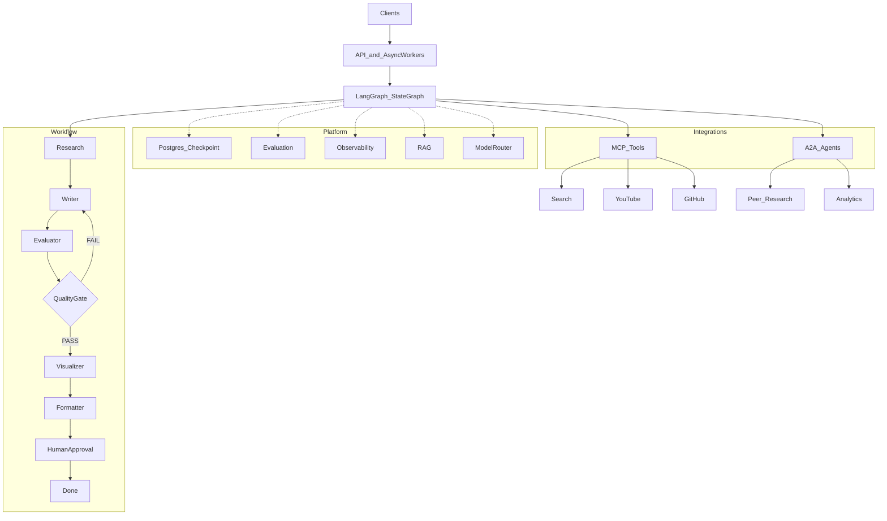
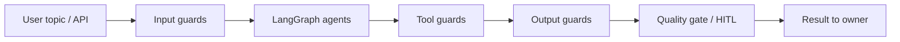

# Solution Architecture — YouTube Shorts Assistant

**Status:** Confirmed target (LangGraph-only). Use this file as the **single consolidated solution view** while implementing phase by phase.  
**Process:** [Master learning roadmap](../plans/00_master_learning_roadmap_24e99839.plan.md)  
**Stack decision:** LangGraph = sole active runtime. Google ADK = `archive/adk_baseline/` only (after Phase 1 implement).

---

## 1. How to use this document


| When                          | Use                                                                                                                                  |
| ----------------------------- | ------------------------------------------------------------------------------------------------------------------------------------ |
| Starting any phase            | Re-read the relevant section + [§8 Phase build-up](#8-phase-build-up-matrix) so you know what already exists vs what this phase adds |
| Designing a phase (Steps 2–3) | Check that the change fits the workflow, platform, or integration layer — do not invent a second orchestrator                        |
| Reviewing PRs / learning      | Trace the change back to a box in [§3 Consolidated view](#3-consolidated-system-view)                                                |


**Rules:** One phase at a time. Teach → approve → implement. Do not implement the full end state in Phase 1.

---


## 2. Problem and product outcome

**Problem:** Turn a developer-focused idea into a YouTube Shorts concept (script + visuals + structured output) with production-grade agent engineering.

**Outcome:** An API-triggered LangGraph workflow that researches, writes, evaluates, quality-gates (with revision loop), visualizes, formats, and optionally waits for human approval — with persistence, eval, observability, RAG, MCP tools, A2A peers, and model routing layered on over time.

---


## 3. Consolidated system view

Three layers, one system:

1. **Entry & jobs** — API + async workers invoke / resume the graph
2. **Workflow** — `StateGraph` nodes and conditional quality-gate edges
3. **Platform & integrations** — checkpointing, eval, obs, RAG, MCP, A2A, router, HITL

```text
                         ┌─────────────────────────────────────┐
                         │         Clients / Operators         │
                         └──────────────────┬──────────────────┘
                                            │
                                            ▼
                         ┌─────────────────────────────────────┐
                         │  API  +  Async workers  (Phase 16)  │
                         └──────────────────┬──────────────────┘
                                            │ invoke / resume
                                            ▼
┌───────────────────────────────────────────────────────────────────────────┐
│                     LangGraph StateGraph (core)                           │
│                                                                           │
│   Research → Writer → Evaluator → QualityGate                             │
│                  ▲            │                                           │
│                  │ FAIL       │ PASS                                      │
│                  └────────────┤                                           │
│                               ▼                                           │
│                        Visualizer → Formatter                             │
│                               │                                           │
│                               ▼                                           │
│                        Human Approval → Done                              │
└───────────────┬─────────────────────────────┬─────────────────────────────┘
                │                             │
        ┌───────▼───────┐             ┌───────▼───────┐
        │ MCP (Ph 12)   │             │ A2A (Ph 15)   │
        │ Tools / Data  │             │ Other Agents  │
        │ Search        │             │ Research      │
        │ YouTube       │             │ Analytics     │
        │ GitHub        │             └───────────────┘
        └───────────────┘

        Platform (wrap / support the graph — not a second runtime):
        ├── PostgreSQL / checkpointing (10)
        ├── Evaluation online + offline dataset (4, 5, 8)
        ├── Observability (9)
        ├── RAG (11)
        ├── Model Router (14)
        └── Human-in-loop mechanism (13)  ← also a graph interrupt node
```




---


## 4. Workflow architecture (nodes and edges)

**Semantics:** Nodes are **sequential** unless a **conditional edge** routes otherwise. Research / Writer / Evaluator are not a parallel fan-out.


| Node           | Responsibility                                               | Primary phase |
| -------------- | ------------------------------------------------------------ | ------------- |
| Research       | Gather context for the idea (tools/RAG later)                | 2–3, +11/12   |
| Writer         | Produce / revise Shorts script                               | 3, 5          |
| Evaluator      | Score/judge script; **does not** mutate script               | 4             |
| Quality Gate   | Deterministic PASS / FAIL / exhaust using scores + iteration | 5             |
| Visualizer     | Visual concepts from approved script                         | 3–5           |
| Formatter      | Structured `ShortConcept` (or successor schema)              | 3             |
| Human Approval | `interrupt` / resume before Done                             | 13            |
| Done           | Terminal success                                             | —             |


**Quality loop:** FAIL → Writer (then Evaluator again). PASS → Visualizer → Formatter → HITL → Done. Max iterations enforced in gate/state (Phase 5).

**Typed state (Phase 2):** channels for topic, research notes, script, evaluation, best_script/best_score, iteration, visuals, final concept, approval flags, errors.

---


## 5. Platform capabilities

Bolted onto LangGraph — **not** a second orchestrator.


| Capability                 | Phase   | What it does                                   |
| -------------------------- | ------- | ---------------------------------------------- |
| PostgreSQL / checkpointing | 10      | Durable thread state + domain records          |
| Evaluation                 | 4, 5, 8 | Online evaluator node + offline golden dataset |
| Observability              | 9       | Traces/metrics/logs per node / run             |
| RAG                        | 11      | Retrieval into Research/Writer context         |
| MCP                        | 12      | Tools/data (Search, YouTube, GitHub, …)        |
| A2A                        | 15      | Peer agents (Research, Analytics, …)           |
| Model Router               | 14      | Model choice per node/task                     |
| Human-in-loop              | 13      | Approval interrupt/resume                      |
| API                        | 16      | HTTP entry                                     |
| Async workers              | 16      | Background run/resume                          |
| Security / guardrails      | 17      | Authn/z, rate limits, input/output/tool guards |


Leaf MCP/A2A names are **examples of shape**; exact servers/peers chosen when those phases start.

### LLM guardrails (Phase 17 teaching model)

Five categories (privacy, relevance, language, content integrity, logic/schema)—layered around the graph, not a second runtime. Full taxonomy + Shorts mapping: [17_phase_security_guardrails…](../plans/17_phase_security_guardrails_d1e7b8a8.plan.md).



---


## 6. Integration spokes (MCP + A2A)

```text
                    LangGraph
                        │
              ┌─────────┴─────────┐
              │                   │
             MCP                 A2A
              │                   │
        Tools / Data          Other Agents
              │                   │
      ┌───────┼───────┐       ┌───┴────┐
      ▼       ▼       ▼       ▼        ▼
   Search  YouTube  GitHub  Research  Analytics
```

- **MCP:** adapters called from graph nodes (Phase 12).  
- **A2A:** custom LG client node(s), not ADK `RemoteA2aAgent` (Phase 15).  
- Failures surface through Phase 6 failure-handling patterns when that phase is expanded.

---


## 7. Target repository shape

```text
youtube_shorts_assistant/
├── docs/
│   ├── architecture/
│   │   └── solution_architecture.md   ← this file
│   └── plans/                         ← phase plans 00–21
├── archive/
│   └── adk_baseline/                  ← ADK experiment (Phase 1+)
├── src/
│   └── shorts_assistant/              ← LangGraph app (Phase 1+)
│       ├── graph.py                   ← StateGraph compose
│       ├── state.py                   ← typed state (Phase 2+)
│       ├── nodes/                     ← research, writer, …
│       ├── config.py
│       ├── schemas.py
│       └── ...
├── tests/
├── evals/                             ← offline eval (Phase 8+; ADK evalsets archived)
├── requirements.txt
├── requirements-dev.txt
└── README.md
```

Dormant until their phases: Docker/CI already on disk stay untouched until deploy/CI phases; do not treat them as active Phase 1 lessons.

---


## 8. Phase build-up matrix

After each phase completes, the solution grows as follows (cumulative).


| Phase | Adds to the solution view                                                            |
| ----- | ------------------------------------------------------------------------------------ |
| 1     | Repo hygiene; ADK → archive; `src/shorts_assistant` + **stub** graph; LangGraph deps |
| 2     | Typed `StateGraph` state / channels                                                  |
| 3     | Structured LLM contracts (Writer/Formatter schemas)                                  |
| 4     | Real Evaluator node                                                                  |
| 5     | Quality Gate + FAIL/PASS edges + revision loop                                       |
| 6     | Production failure handling (expand stub when reached)                               |
| 7     | Test strategy / pyramid for graph                                                    |
| 8     | Offline evaluation dataset + harness                                                 |
| 9     | Observability                                                                        |
| 10    | PostgreSQL + LangGraph checkpointer                                                  |
| 11    | RAG / memory into nodes                                                              |
| 12    | MCP tools (Search/YouTube/GitHub shape)                                              |
| 13    | Human Approval interrupt/resume                                                      |
| 14    | Model Router                                                                         |
| 15    | A2A peer-agent node                                                                  |
| 16    | API + async workers                                                                  |
| 17    | Security / guardrails (API + 5-category LLM taxonomy: privacy, relevance, language, content, logic) |
| 18    | AI CI/CD gates                                                                       |
| 19    | Production deploy                                                                    |
| 20    | LangGraph parity / hardening                                                         |
| 21    | ADR documenting LangGraph-only + ADK archived                                        |


---


## 9. Architecture principles

1. **One orchestrator:** LangGraph only.
2. **Deterministic control where it matters:** quality gate and max iterations are code, not “hope the LLM stops.”
3. **Contracts over free text:** structured outputs at Writer/Evaluator/Formatter boundaries.
4. **Integrations are adapters:** MCP/A2A hang off nodes; they do not own the workflow.
5. **Phase-sized increments:** each phase lights up one concept on this diagram.
6. **Archive, don’t mix:** ADK remains historical reference under `archive/adk_baseline/`.

---


## 10. Non-goals (global)

- Dual ADK + LangGraph production runtimes  
- Blind class-for-class ADK → LangGraph translation  
- Building the full consolidated diagram in Phase 1  
- Expanding Docker/K8s as a Phase 1 lesson

---


## 11. Related plans


| Topic                    | Plan                                                                                                               |
| ------------------------ | ------------------------------------------------------------------------------------------------------------------ |
| Process + phase index    | [00_master…](../plans/00_master_learning_roadmap_24e99839.plan.md)                                                 |
| Hygiene + archive + stub | [01_…](../plans/01_phase_repo_hygiene_dce91540.plan.md)                                                            |
| State                    | [02_…](../plans/02_phase_workflow_state_6cfb4cd5.plan.md)                                                          |
| Contracts                | [03_…](../plans/03_phase_structured_contracts_82d939d7.plan.md)                                                    |
| Evaluator / quality loop | [04_…](../plans/04_phase_real_evaluator_99ae754e.plan.md), [05_…](../plans/05_phase_quality_loop_ad5c8440.plan.md) |
| Platform phases          | [08–16](../plans/)                                                                                                 |
| ADR                      | [21_…](../plans/21_phase_adk_vs_langgraph_adr_26a2def9.plan.md)                                                    |


