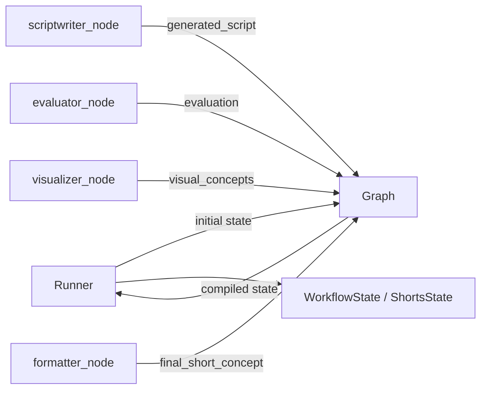
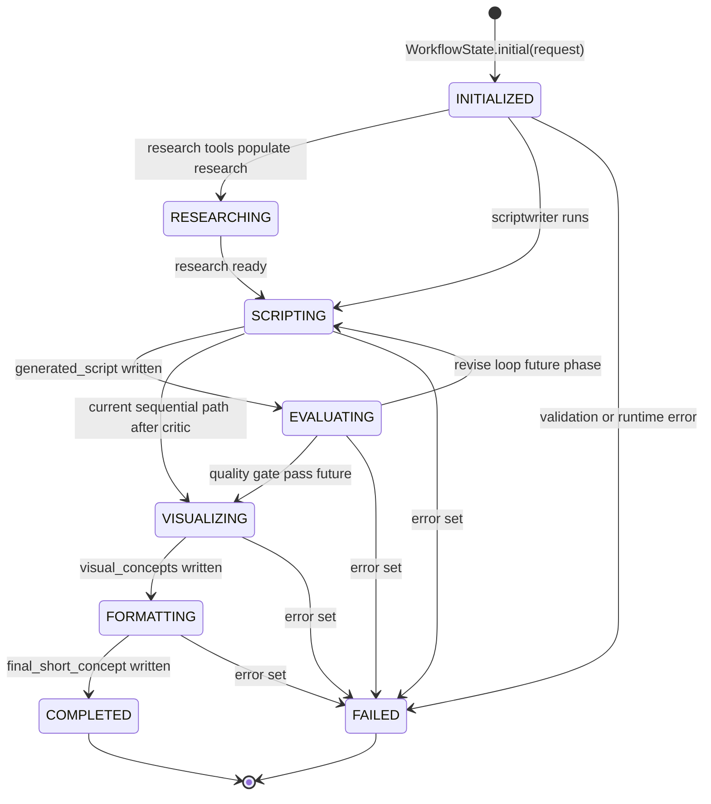

# Phase 2 — Explicit Agent Workflow State


## Master alignment
- Active stack: LangGraph only
- ADK: archive only (not a second runtime)
- If this plan still describes ADK APIs below, treat them as historical; redesign for LangGraph in Steps 2–3 of the phase loop
- Consolidated view: [../architecture/solution_architecture.md](../architecture/solution_architecture.md) §4 typed state

## Inspect findings (2026-08-01, post Phase 1)

| Area | Finding |
|------|---------|
| Active package | [`src/shorts_assistant/`](../../src/shorts_assistant/) — LangGraph only |
| Graph state today | [`graph.py`](../../src/shorts_assistant/graph.py) uses ad-hoc `StubState` (`topic` / `status` / `message`) — **not** domain workflow state |
| Schemas | [`schemas.ShortConcept`](../../src/shorts_assistant/schemas.py) types **formatter output only**, not the full run |
| Runner | No active `runner.py` (archived under `archive/adk_baseline/`). Entry is `__main__.py` + `get_compiled_graph().invoke(...)` |
| Loop fields | `iteration` / `best_script` / `best_score` / `evaluation` **do not exist** yet |
| Persistence | None — correct for Phase 2 (no new DB) |
| Tests | [`tests/test_graph_imports.py`](../../tests/test_graph_imports.py) asserts stub keys; will need update when state contract lands |

## Scope lock

- Framework: LangGraph only (no ADK runtime, no new state store beyond graph state)
- One concept: **explicit typed workflow state**
- Do **not** introduce a database for workflow state
- Do **not** implement the revision loop yet (Phases 4–5) — only reserve fields
- Do **not** add Research/Writer/Evaluator/Visualizer nodes yet — keep a single stub/passthrough node
- Keep system runnable: graph invoke path works; typed state is the channel contract

**Concrete approach (locked for implement):**

1. Add [`src/shorts_assistant/state.py`](../../src/shorts_assistant/state.py) — Pydantic `WorkflowState` as **source of truth** (validate + helpers).
2. Use `WorkflowState` (or its dict projection) as the LangGraph `StateGraph` schema — replace `StubState`.
3. Seed invoke via `WorkflowState.initial(request).to_dict()`; stub node returns a partial update (e.g. set `status`); wrap-up validates with `WorkflowState.from_dict(result)`.
4. Leave `ShortConcept` nested on `final_short_concept` for later formatter phases.
5. Wire [`graph.py`](../../src/shorts_assistant/graph.py) + [`__main__.py`](../../src/shorts_assistant/__main__.py) — **not** archived ADK `runner.py`.

---

## Teaching (before coding)

### 1. What is workflow state?

The **end-to-end business state** of one Shorts generation run: inputs, intermediates, scores, loop counters, status, errors. It answers: “Where is this request in the pipeline, and what do we know so far?”

It is **domain-shaped** (`raw_idea`, `generated_script`, `best_score`), not framework-shaped.

### 2. What is agent state?

**Per-node / framework bookkeeping** inside LangGraph (current node, checkpoint metadata). It is for the framework’s control flow, not your product schema.

Do not confuse framework control state with `WorkflowState`.

### 3. What is graph / session state?

LangGraph **graph state**: the typed dict/channels passed between nodes (and optionally checkpointer thread state). Nodes return partial updates; reducers merge them.

Historical ADK used a mutable `session.state` dict + `output_key`. This phase defines an **explicit** typed contract instead of implicit keys.

### 4. What is persistent state?

Session (or other) data that **survives process restart** (SQLite/Postgres/etc.).  
Phase 2: define and validate the **in-memory typed model** and its dict projection. Persistence of that dict is a later phase concern — do not add a new DB for workflow state now.

### 5. Who owns state?

| Layer | Owner | Responsibility |
|-------|--------|----------------|
| Workflow contract | Our code (`WorkflowState`) | Field names, types, invariants, status transitions helpers |
| Transport | LangGraph state + optional checkpointer | Store/load state for a thread/run |
| Writers | Graph nodes (+ runner on init) | Produce values for specific channels |
| Readers | Later nodes (prompts), runner, tests | Consume typed or dict form |

**Rule:** Agents must not invent ad-hoc keys outside the contract without updating `WorkflowState`.

### 6. How does state move between agents?



LangGraph passes **state updates** between nodes. Typed state (Pydantic/`TypedDict`) is the contract for those channels.

### 7. Why is implicit state dangerous?

- Typos (`genrated_script`) fail silently at runtime
- No invariants (`iteration > max_iterations`, negative scores)
- Hard to test transitions
- Prompts and code drift apart
- Future loops (best_script / best_score) become ungovernable without a contract

---

## Current insufficiency

- Graph uses `StubState` (`topic`/`message`) — product keys from the solution architecture are missing
- No shared contract for `generated_script`, `evaluation`, `iteration`, `best_*`
- Invalid values cannot fail loudly before later phases pile on nodes
- `__main__.py` seeds ad-hoc dict keys, not `WorkflowState.initial(...)`

---

## Design decision (for approval)

Introduce:

```text
src/shorts_assistant/state.py
  WorkflowStatus (str Enum)
  EvaluationResult (Pydantic)
  WorkflowState (Pydantic BaseModel)
```

**Fields (exact contract):**

| Field | Type | Initial |
|-------|------|---------|
| `request` | `str` | user query |
| `raw_idea` | `str` | same as request |
| `research` | `str \| None` | `None` |
| `generated_script` | `str \| None` | `None` |
| `script_version` | `int` (>=0) | `0` |
| `evaluation` | `EvaluationResult \| None` | `None` |
| `visual_concepts` | `str \| None` | `None` |
| `final_short_concept` | `ShortConcept \| None` | `None` |
| `iteration` | `int` (>=0) | `0` |
| `max_iterations` | `int` (>=1) | `3` |
| `best_script` | `str \| None` | `None` |
| `best_score` | `float \| None` (0–1) | `None` |
| `status` | `WorkflowStatus` | `INITIALIZED` |
| `error` | `str \| None` | `None` |

`WorkflowStatus`: `INITIALIZED`, `RESEARCHING`, `SCRIPTING`, `EVALUATING`, `VISUALIZING`, `FORMATTING`, `COMPLETED`, `FAILED`.

`EvaluationResult`: `score: float` (0–1), `passed: bool`, `notes: str = ""`.

**API (smallest useful):**

- `WorkflowState.initial(request: str, *, max_iterations: int = 3) -> WorkflowState`
- `to_dict() -> dict` — JSON-ready for `graph.invoke`
- `from_dict(data: dict) -> WorkflowState` — Pydantic validate
- `apply_update(**fields) -> WorkflowState` — new validated instance

**LangGraph wiring (minimal):**

- `StateGraph` schema = `WorkflowState` (Pydantic) **or** dict channels seeded/validated by it — prefer Pydantic if the installed LangGraph accepts it; otherwise TypedDict mirror + validate at boundaries
- Stub node: read `request`/`raw_idea`, return partial update e.g. `{status: SCRIPTING}` or a clear stub marker without inventing new keys
- `__main__.py`: `initial(topic).to_dict()` → invoke → `from_dict(result)` → print
- Update Phase 1 stub tests for new keys
- Do **not** add a database

**Alternatives rejected:**

- Keep `StubState` + add parallel `WorkflowState` unused by graph — dual contracts
- Untyped dict only — weak invalid-value failures
- New DB / checkpointer — Phase 10
- Full status FSM enforced on every write — too heavy for Phase 2
- Wire archived ADK `runner.py` — rejected (LangGraph-only)

---

## Tests ([`tests/test_workflow_state.py`](../../tests/test_workflow_state.py))

| Case | Assert |
|------|--------|
| Initial state | `initial("idea")` sets request/raw_idea, zeros counters, status=INITIALIZED, optionals None |
| Valid updates | `apply_update(generated_script="...", script_version=1, status=SCRIPTING)` validates |
| Missing values | `from_dict({})` or missing `request` raises validation error |
| Invalid values | negative `iteration`, `max_iterations=0`, `best_score=1.5`, bad status string → ValidationError |
| Graph smoke | invoke with `initial(...)` returns state that `from_dict` accepts |

No live LLM calls.

---

## Files to touch

| File | Change |
|------|--------|
| **Add** `src/shorts_assistant/state.py` | `WorkflowState` + helpers |
| **Update** `graph.py`, `__main__.py`, `__init__.py` | replace StubState; export state helpers if useful |
| **Add** `tests/test_workflow_state.py` | cases above |
| **Update** `tests/test_graph_imports.py` | assert WorkflowState channels |
| Optional README one-liner | “Workflow state contract in `state.py`” |

**Do not touch yet:** Docker, new DB, quality-loop, evaluator, MCP, Research/Writer nodes.

---

## State lifecycle (Mermaid)



**Note:** Today’s graph is still sequential (script → critic → visual → format). Status values exist so later phases can drive RESEARCHING / EVALUATING / revision without renaming fields.

---

## Implementation order (after approval)

1. Add `src/shorts_assistant/state.py`
2. Add `tests/test_workflow_state.py`; run them
3. Wire `graph.py` + `__main__.py` (+ stub tests)
4. Smoke: pytest + `python -m shorts_assistant "..."`
5. Wrap-up: lifecycle Mermaid + what you learned

## Exit criteria

- Typed `WorkflowState` is the single contract for workflow keys
- Round-trip dict ↔ model works
- Invalid/missing values fail loudly in tests
- No new database
- Graph invoke uses WorkflowState channels (StubState removed)
- Lifecycle diagram in the phase wrap-up

## Approval gate

Reply **Approve Phase 2 design — implement** to proceed, or **Revise: …** to adjust the contract.
