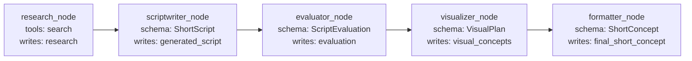
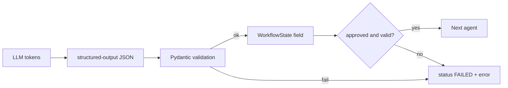

# Phase 3 — Structured LLM Contracts


## Master alignment
- Active stack: LangGraph only
- ADK: archive only (not a second runtime)
- If this plan still describes ADK APIs below, treat them as historical; redesign for LangGraph in Steps 2–3 of the phase loop
- Solution view: [../architecture/solution_architecture.md](../architecture/solution_architecture.md)

## Inspect findings (2026-08-01, post Phase 2)

| Area | Finding |
|------|---------|
| State | [`state.py`](../../src/shorts_assistant/state.py) has `generated_script: str \| None`, `visual_concepts: str \| None`, `evaluation: EvaluationResult` (0–1 score) — **not** yet ShortScript / VisualPlan / ScriptEvaluation |
| Schemas | Only `ShortConcept` (+ `ScriptVisualRow`) in [`schemas.py`](../../src/shorts_assistant/schemas.py) |
| Graph | Single `_stub_node` — no Research/Writer/Eval/Visual/Format nodes |
| Contracts module | Missing |
| Score scale clash | Phase 2 `best_score` / `EvaluationResult.score` are 0–1; Phase 3 `ScriptEvaluation` is **0–10** — align by replacing `EvaluationResult` with `ScriptEvaluation` and allowing `best_score` 0–10 |

## Dependency

Phase 2 is done. Phase 3 **refines** nested field types into validated models and wires a sequential contract graph.

## Scope lock

- One concept: **structured LLM output contracts + validation**
- Stay on LangGraph (Pydantic contracts; structured-output ready nodes)
- Do **not** build the revision loop / best-version selection (Phase 5)
- Do **not** deepen “real evaluator” prompting (Phase 4 can replace demo/LLM evaluator quality)
- Do **not** introduce a new database / Docker / K8s
- Keep runnable after the step (tests without live LLM; optional live path if key present)

---

## Teaching (before coding)

### Pipeline

```text
LLM text
  → structured output   (model constrained to JSON / schema)
  → validation          (Pydantic: types, ranges, required fields)
  → state               (only valid objects written into WorkflowState)
  → workflow decision   (continue / fail / later: revise)
```

| Stage | What happens | Failure mode if skipped |
|-------|----------------|-------------------------|
| LLM text | Model emits tokens | Free-form prose, markdown fences, missing fields |
| Structured output | LG structured-output / schema steers JSON shape | Still can be wrong types/ranges |
| Validation | Pydantic parse + invariants | Downstream assumes fields that aren’t there |
| State | Write only validated objects | Poisoned graph state |
| Workflow decision | `approved` / `status=FAILED` / stop | Visualizer formats garbage; silent quality loss |

### Why this matters in production AI systems

1. **Deterministic interfaces** — tools, UIs, and later agents need fields, not essays  
2. **Fail fast** — malformed output is a first-class error, not a vague “bad short”  
3. **Evaluability** — scores and `approved` are machine-checkable (Phase 4–9)  
4. **Safety** — prevents propagating invented structure into persistence, APIs, or HITL queues  
5. **Cost control** — don’t run visualizer/formatter tokens on invalid scripts  

Natural language is for humans. **Contracts are for systems.**

---

## What is wrong today

| Agent | Output | Problem |
|-------|--------|---------|
| Scriptwriter | Free text via `output_key` | No hook/CTA/duration structure; hard to score |
| Critic | Free-text rewrite into same key | Not an evaluation contract; overwrites script without scores |
| Visualizer | Free text | Beats not aligned to script structure |
| Formatter | `ShortConcept` schema already | Good pattern — extend upstream to match |

Also: prefer **splitting** tool-using Research from schema-constrained Scriptwriter (same lesson whether ADK historically blocked tools+schema on one agent, or you keep LG nodes single-purpose).

---

## Design decision (concrete schema — not a copy of the example)

Score scale for this app: **0.0–10.0** (one decimal OK).  
`approved` is a **boolean gate**, not “score > 7” alone (model must set it; tests can also enforce consistency rules lightly).

### 1. `ShortScript` (replaces opaque `generated_script` string)

```python
class ScriptSection(BaseModel):
    label: Literal["hook", "body", "cta"]
    text: str = Field(min_length=1)
    estimated_seconds: float = Field(ge=0.5, le=30)

class ShortScript(BaseModel):
    title: str = Field(min_length=1, max_length=120)
    hook: str = Field(min_length=1)
    body: str = Field(min_length=1)
    cta: str = Field(min_length=1)
    target_audience: str = "developers"
    estimated_duration_seconds: float = Field(ge=15, le=60)
    sections: list[ScriptSection] = Field(min_length=3, max_length=8)
```

**Why this shape:** Matches Shorts pedagogy (hook/body/CTA + duration budget) and gives the evaluator concrete fields to score—without over-modeling film scripts.

### 2. `VisualPlan` (replaces opaque `visual_concepts` string)

```python
class VisualShot(BaseModel):
    beat: str  # e.g. "hook" or "0-3s"
    description: str
    on_screen_text: str = ""
    shot_type: Literal["screen_recording", "diagram", "code_overlay", "ui", "b_roll", "title_card"]

class VisualPlan(BaseModel):
    shots: list[VisualShot] = Field(min_length=3, max_length=8)
    pacing: str
    graphics_notes: str = ""
    b_roll: list[str] = Field(default_factory=list)
```

**Why:** Aligns with existing visualizer prompt (shots, pacing, overlays, B-roll) in a consumable list.

### 3. `ScriptEvaluation` (evaluation contract)

Designed for **developer Shorts**, not generic essay grading:

```python
class ScriptEvaluation(BaseModel):
    overall_score: float = Field(ge=0, le=10)
    hook_score: float = Field(ge=0, le=10)
    clarity_score: float = Field(ge=0, le=10)
    pacing_score: float = Field(ge=0, le=10)          # fits <60s
    technical_accuracy: float = Field(ge=0, le=10)
    developer_value: float = Field(ge=0, le=10)
    tone_score: float = Field(ge=0, le=10)             # pro, no hype
    issues: list[str] = Field(default_factory=list)
    approved: bool
    summary: str = ""
```

**Deliberate differences from the sample JSON:** added `pacing_score` and `tone_score` (core to this product); kept `issues` + `approved`; used 0–10 consistently.

Keep existing [`ShortConcept`](schemas.py) for final formatter output.

### Module layout

- Expand [`schemas.py`](schemas.py) with the three models (+ keep `ShortConcept`)
- Add [`contracts.py`](contracts.py):
  - `parse_contract(model_type, raw) -> T`
  - `ContractValidationError` with agent name + errors
  - `guard_script` / `guard_visuals` / `guard_evaluation` helpers used by state updates and tests

---

## Agent wiring (smallest graph change that makes contracts real)



Concrete changes in the LangGraph graph/nodes module:

1. **research_node** — tools (e.g. search), plain-text `research` (no structured schema required)
2. **scriptwriter_node** — no tools; structured `ShortScript` → `generated_script`
3. **Replace Critic rewrite** with **evaluator_node** — structured `ScriptEvaluation` → `evaluation` (does **not** overwrite script in Phase 3)
4. **visualizer_node** — structured `VisualPlan`
5. **formatter_node** — unchanged `ShortConcept`

Update prompts to describe JSON field contracts (briefly; schema is source of truth).

**Workflow decision in Phase 3 (minimal):**  
If evaluation present and `approved is False`, runner sets `status=FAILED` (or `status=EVALUATING` + error notes) and **does not treat the run as success**—still sequential (no auto-revise yet). That teaches the gate without Phase 5 loops.

**Prevent invalid downstream consumption:**

- `WorkflowState.apply_update` / typed setters only accept validated models
- Visualizer node guard: require `generated_script` parseable as `ShortScript`; on failure set `error` and skip/fail
- Formatter node guard: require `VisualPlan` + `ShortScript`
- Runner: on `ContractValidationError`, return `RunResult(ok=False, error=...)`

---

## Align Phase 2 `WorkflowState` fields

| Field | Phase 3 type |
|-------|----------------|
| `research` | `Optional[str]` |
| `generated_script` | `Optional[ShortScript]` |
| `evaluation` | `Optional[ScriptEvaluation]` |
| `visual_concepts` | `Optional[VisualPlan]` |
| `final_short_concept` | `Optional[ShortConcept]` |
| `best_score` | map from `evaluation.overall_score` only in later phases |

`to_dict` / node updates store model_dump for nested models (JSON-friendly).

---

## Validation failure handling

| Failure | Behavior |
|---------|----------|
| Malformed / schema miss | `ContractValidationError`; do not write bad value into state |
| Missing upstream contract | Downstream callback refuses to run; `status=FAILED`, `error=...` |
| Evaluation `approved=False` | Run completes agents only if we keep sequential; runner marks `ok=False` **or** stops before visualizer via callback — **chosen default:** Visualizer callback requires `evaluation.approved is True`; otherwise fail closed |

Fail closed is the production-correct default for this learning phase.

---

## Tests

Add [`tests/test_contracts.py`](tests/test_contracts.py) (and extend workflow state tests):

1. **Valid** `ShortScript` / `VisualPlan` / `ScriptEvaluation` parse  
2. **Malformed** JSON / missing fields / score `11` / duration `120` → validation error  
3. **State guard** — cannot `apply_update(visual_concepts=...)` path used by downstream without valid script (helper test)  
4. **Approved gate** — `approved=False` blocks “ready for visuals” helper  
5. **Node wiring** — scriptwriter emits `ShortScript` and has no tools; research has tools; evaluator schema is `ScriptEvaluation`

No live LLM required for contract tests.

---

## What NOT to change yet

- Full revise loop / conditional-edge quality cycle / best_script selection (Phases 5–6)
- Real multi-sample eval dataset (Phase 9)
- Persistence redesign, MCP, HITL, model routing, A2A
- Docker / K8s
- Blindly copying the sample score JSON without `pacing_score` / `tone_score`

---

## Alternatives considered

| Approach | Verdict |
|----------|---------|
| Prompt-only “please output JSON” without structured output | Rejected — weak in production |
| Keep critic as free-text rewriter | Rejected for Phase 3 — not an evaluation contract |
| tools + structured script on same node | Rejected — split Research vs Scriptwriter |
| Scores normalized 0–1 | Rejected — 0–10 matches product language and your example scale |

---

## Implement approach (locked for approval)

1. **`schemas.py`** — add `ShortScript`, `VisualPlan`, `ScriptEvaluation` (shapes in § Design decision); keep `ShortConcept`
2. **`contracts.py`** — `ContractValidationError`, `parse_contract`, `guard_script` / `guard_evaluation` / `guard_visuals`, `ready_for_visuals(evaluation) -> bool` (requires `approved is True`)
3. **`state.py`** — nest `ShortScript` / `ScriptEvaluation` / `VisualPlan`; remove `EvaluationResult`; `best_score` range **0–10** to match `overall_score`
4. **`nodes/`** — sequential: `research` → `scriptwriter` → `evaluator` → `visualizer` → `formatter`
   - **Default/demo producers** (no live LLM): build valid contract instances from `request` so CI and local verify work offline
   - **Fail-closed:** visualizer/formatter call guards; if `approved is False` or missing upstream → set `status=FAILED`, `error=...`, skip writing visuals/final
   - Optional later: swap demo producers for `with_structured_output` (Phase 4 can own “real” evaluator quality)
5. **`graph.py`** — replace stub with the five-node chain; `__main__.py` prints final `WorkflowState`
6. **Prompts** — short instruction files under `src/shorts_assistant/prompts/` describing field contracts (schema remains source of truth)
7. **Tests** — `tests/test_contracts.py` + update state/graph tests (no live LLM)

**Out of Phase 3:** quality-gate revision loop, checkpointer, MCP, live-LLM-required CI.

## Approval gate

Reply **Approve Phase 3 design — implement** (or **Revise: …**).

## Implementation order (after you approve)

1. Restate teaching chain in the implementation chat  
2. Add/adjust models in `schemas.py` + `contracts.py`  
3. Align `WorkflowState` nested types (Phase 2 module)  
4. Rewire LangGraph nodes + prompts (Research → Script → Eval → Visual → Format)  
5. Add fail-closed gates  
6. Tests green; smoke import/run  
7. Summarize decisions and show the contract data-flow Mermaid

### Contract data-flow (wrap-up diagram)



## Exit criteria

- Script, visuals, and evaluation are typed contracts  
- Malformed output is detected and does not enter workflow state  
- Downstream visuals/formatting are fail-closed on invalid/unapproved script  
- Tests cover valid, invalid, and gate behavior  
- System still runs on LangGraph without a new database
