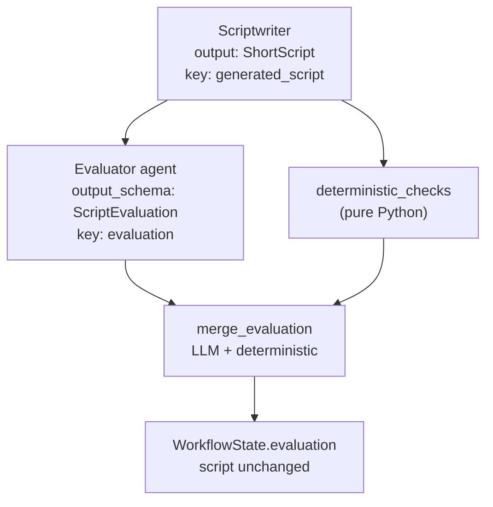

# Phase 4 — Build a Real AI Evaluator


## Master alignment
- Active stack: LangGraph only
- ADK: archive only (not a second runtime)
- If this plan still describes ADK APIs below, treat them as historical; redesign for LangGraph in Steps 2–3 of the phase loop
- Solution view: [../architecture/solution_architecture.md](../architecture/solution_architecture.md)

## Inspect findings (2026-08-01, post Phase 3)

| Area | Finding |
|------|---------|
| Evaluator today | [`evaluator_node`](../../src/shorts_assistant/nodes.py) exists but only calls [`demo_evaluation`](../../src/shorts_assistant/demo_producers.py) — magic `[reject]` string, not a rubric judge |
| Schema | [`ScriptEvaluation`](../../src/shorts_assistant/schemas.py) has hook/clarity/pacing/technical/developer/tone — **missing** `factual_correctness`, `duration_score`, `cta_score` from Phase 4 rubric |
| Deterministic checks | **None** — duration/CTA/section invariants not enforced in code |
| Script mutation | Evaluator already does **not** write `generated_script` (good); keep that invariant |
| Prompt | Thin [`prompts/evaluator.txt`](../../src/shorts_assistant/prompts/evaluator.txt) — needs full judge-only rubric |
| Critic | Archived ADK critic only; no active rewrite critic in LG app |
| Live LLM | `langchain-google-genai` in deps; config has `GOOGLE_API_KEY` / `MODEL_NAME` — not wired into evaluator yet |
| Tests | Contract/fail-closed tests exist; no fixture-based high/poor/malformed/missing evaluator suite |

## Dependency and scope

**Depends on:** Phase 2 + 3 (done).

**This phase’s one concept:** a **real evaluator** (AI-as-judge + deterministic complements) that writes `evaluation` only.

**Out of scope:** revision loop (Phase 5), script rewriting, best-version selection, new database, Docker, ADK runtime, swapping scriptwriter/visualizer to live LLM (can stay demo).

---

## Teaching (before coding)

### Evaluator vs generator

| | Generator (Scriptwriter) | Evaluator |
|--|--------------------------|-----------|
| Goal | Create content | Judge content |
| Output | `ShortScript` | `ScriptEvaluation` |
| Allowed to change script? | Yes (creates it) | **No** |
| Success metric | Useful Short draft | Calibrated, structured judgment |

Mixing both in one agent (today’s Critic rewrite) destroys auditability: you cannot tell “what was generated” from “what was fixed.”

### AI-as-judge

Use an LLM with a **fixed rubric + structured schema** to score another model’s output. Common in LLM ops when human labels are expensive. The judge reads `state['generated_script']` (and `raw_idea` / `research` for grounding) and emits scores + issues + `approved`.

### Weaknesses of LLM evaluation

- **Position/verbosity bias** — prefers longer or earlier content  
- **Self-preference / style bias** — may favor text that “sounds like” the judge model  
- **Hallinated criteria** — invents issues not in the script  
- **Unstable scores** — same script, different numbers across runs  
- **Cannot reliably verify facts** without tools/grounding  
- **Approval drift** — `approved=true` with low scores if unconstrained  

### Why deterministic checks must complement LLM evaluation

Hard rules the model should not “opinion away”:

- `estimated_duration_seconds` within 15–60  
- Required fields present (`hook`, `body`, `cta`)  
- Section labels complete  
- Empty CTA / empty hook  
- Word-count / char-count sanity bounds  

Pattern:

```text
deterministic_checks(script) -> list[Issue]
LLM judge(script) -> ScriptEvaluation
merge: evaluation.issues += deterministic issues
if deterministic hard-fail: approved = False (override)
```

Deterministic layer = **invariants**. LLM layer = **judgment**. Production systems need both.

---

## What is wrong today

Phase 3 left a **placeholder judge**:

- `demo_evaluation` approves everything unless request contains `[reject]`  
- No deterministic duration/CTA/section checks  
- Rubric incomplete vs product criteria  
- No live structured-output path (optional) and no fixture suite for high/poor scripts  

Archived ADK Critic was a rewriter; LG already split eval from script — Phase 4 must make eval **substantive**.

---

## Target workflow (this phase)



Conceptual chain you asked for:

**Scriptwriter → Evaluator → Evaluation Result**  
(Visualizer/Formatter may follow later; evaluator never writes `generated_script`.)

---

## Concrete design

### Expand `ScriptEvaluation` rubric fields

Align with your criteria (0.0–10.0), beyond the Phase 3 draft:

| Field | Maps to |
|-------|---------|
| `hook_score` | hook quality |
| `clarity_score` | clarity |
| `technical_accuracy` | technical accuracy |
| `factual_correctness` | factual correctness |
| `developer_value` | developer value |
| `pacing_score` | pacing |
| `duration_score` | duration fitness |
| `cta_score` | CTA quality |
| `overall_score` | overall quality |
| `issues: list[str]` | concrete problems |
| `approved: bool` | gate for later phases |
| `summary: str` | short rationale |

### Dedicated evaluator agent

```python
def evaluator_node(state: WorkflowState) -> dict:
    # call model with structured ScriptEvaluation output
    # return {"evaluation": parsed}  # NEVER mutate generated_script
    ...
```

- Remove / replace rewrite-style Critic path  
- Prompt must state: **Do not rewrite the script. Judge only.**  
- Input: `state['generated_script']`, `state['raw_idea']`, optional `state['research']`

### Deterministic complement ([`evaluation_checks.py`](evaluation_checks.py))

Pure functions, no LLM:

- Missing/invalid `ShortScript` → hard fail issue  
- Duration outside 15–60 → hard fail  
- Empty hook/CTA → hard fail  
- `sections` missing hook/body/cta labels → hard fail  

`merge_evaluation(llm_result, deterministic_issues) -> ScriptEvaluation`:

- Append deterministic issues  
- If any hard-fail: force `approved=False`  
- Optionally cap `duration_score` when duration check fails  

Apply merge in:

- post-node hook on evaluator, **or**  
- runner post-step when reading `evaluation`  

**Chosen default:** merge inside/after `evaluator_node` so graph state stores the merged result before downstream nodes run.

### Missing script handling

- Evaluator node guard: if `generated_script` missing/invalid → set `status=FAILED`, `error="missing or invalid generated_script"`, skip LLM call, do not invent scores  
- Tests assert this path without calling the model (callback/unit level)

### Malformed evaluation

- Structured output + Pydantic validation  
- `contracts.parse_contract(ScriptEvaluation, raw)` in tests and merge path  
- On failure: `status=FAILED`, leave `generated_script` untouched, `evaluation` unset or prior cleared

---

## Tests ([`tests/test_evaluator.py`](tests/test_evaluator.py))

Use **fixtures** (no live LLM for unit tests):

| Test | Setup | Expect |
|------|--------|--------|
| High-quality script | Valid `ShortScript` fixture + strong synthetic `ScriptEvaluation` | merge keeps `approved=True` when det checks pass; scores in range |
| Poor script | Short/empty CTA, duration 90s, weak hook | deterministic hard-fail → `approved=False`; issues non-empty |
| Malformed evaluation | score `11`, missing `approved`, bad types | `ValidationError` / `ContractValidationError` |
| Missing script | `WorkflowState` without `generated_script` | evaluator guard fails closed; no script mutation |

Also structural test: evaluator node writes `evaluation` only and never `generated_script`.

Optional golden: load JSON fixtures under `tests/fixtures/scripts/`.

---

## Files to add/change

| File | Action |
|------|--------|
| [`schemas.py`](schemas.py) | Finalize `ScriptEvaluation` fields listed above |
| **Add** `evaluator_instruction.txt` | Judge-only rubric prompt |
| **Add** `evaluation_checks.py` | Deterministic checks + merge |
| Graph / nodes module | Replace Critic with evaluator_node; wire guards |
| [`contracts.py`](contracts.py) | Ensure eval parse helpers (from Phase 3) |
| [`state.py`](state.py) | `evaluation: Optional[ScriptEvaluation]`; never overwritten script by eval |
| **Add** `tests/test_evaluator.py` (+ fixtures) | Cases above |
| Delete or stop using `critic_instruction.txt` | Avoid two competing judge prompts |

**Do not change yet:** quality-loop revision, `best_script` selection, visualizer redesign beyond existing Phase 3 plan, persistence, MCP.

---

## Alternatives considered

| Approach | Verdict |
|----------|---------|
| Keep Critic that rewrites then “scores” | Rejected — mutates generator output |
| Evaluator-only LLM, no deterministic checks | Rejected — duration/CTA invariants must be code |
| Human-only eval | Later (HITL phase); not Phase 4 |
| Tool-using fact-checker in evaluator | Deferred — factual_correctness is LLM-judged for now; research grounding via `state['research']` only |

---

## Implement approach (locked for approval)

1. **Expand `ScriptEvaluation`** — add `factual_correctness`, `duration_score`, `cta_score` (keep existing Phase 3 fields including `tone_score`)
2. **Add `evaluation_checks.py`**
   - `deterministic_checks(script) -> list[DeterministicIssue]` (hard-fail flags for duration, empty hook/CTA, missing section labels)
   - `merge_evaluation(llm_or_synthetic, issues) -> ScriptEvaluation` — append issues; hard-fail forces `approved=False`; optionally cap `duration_score`
3. **Judge path in `evaluator_node`**
   - Guard: missing/invalid script → `FAILED`, no invented scores, **never** touch `generated_script`
   - Prefer live Gemini structured output when credentials validate; else **synthetic rubric judge** (replace magic-only `[reject]` with scoring heuristics on script quality + still honor `[reject]` for smoke)
   - Always run `merge_evaluation` before writing `evaluation`
4. **Prompt** — expand `prompts/evaluator.txt` (judge-only; full rubric; do not rewrite)
5. **Fixtures** — `tests/fixtures/scripts/high_quality.json`, `poor_quality.json` + `tests/test_evaluator.py`
6. **Update** `demo_evaluation` / nodes / contract tests for new required rubric fields
7. **Do not** implement Phase 5 revise loop

**CI rule:** unit tests never require a live API key (synthetic + merge + fixtures).

## Approval gate

Reply **Approve Phase 4 design — implement** or **Revise: …**.

## Implementation order (after approval)

1. Restate teaching briefly  
2. Finalize `ScriptEvaluation` schema  
3. Add `evaluation_checks.py` + fixture tests  
4. Upgrade `evaluator_node` + prompt; merge always  
5. Confirm script unchanged after eval  
6. pytest + smoke  
7. Wrap-up Mermaid + Phase 5 preview  

## Exit criteria

- Dedicated evaluator path with full rubric + merge  
- Evaluator **never** writes `generated_script`  
- Deterministic checks can force `approved=False`  
- Tests: high-quality, poor, malformed, missing-script  
- No revision loop
