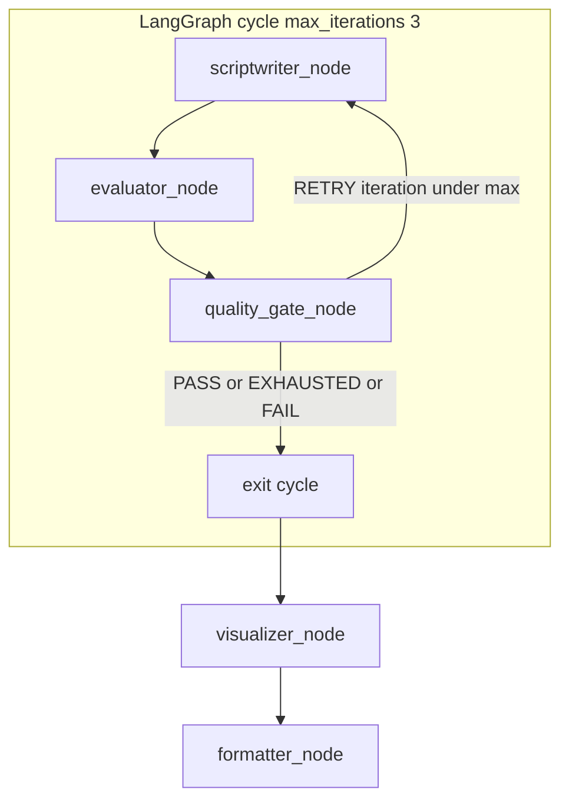
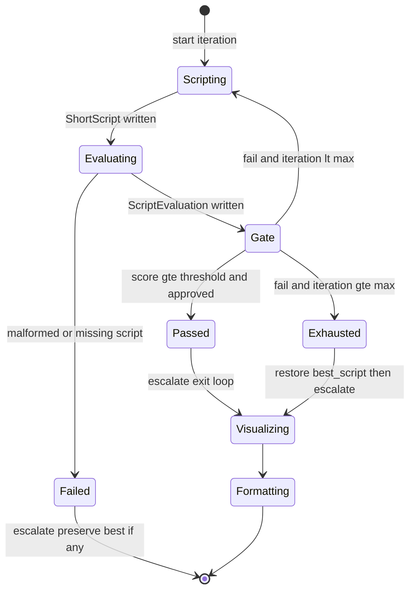

# Phase 5 — Genuine Quality-Controlled Agent Loop


## Master alignment
- Active stack: LangGraph only
- ADK: archive only (not a second runtime)
- If this plan still describes ADK APIs below, treat them as historical; redesign for LangGraph in Steps 2–3 of the phase loop
- Solution view: [../architecture/solution_architecture.md](../architecture/solution_architecture.md) §4 Quality loop

## Inspect findings (2026-08-01, post Phase 4)

| Area | Finding |
|------|---------|
| Graph today | Linear: research → script → eval → **visualizer** → format ([`graph.py`](../../src/shorts_assistant/graph.py)) — **no** quality_gate, **no** conditional edges |
| Fail path | Unapproved eval → visualizer sets `FAILED` and stops — no rewrite retry |
| Evaluator | [`judge_script`](../../src/shorts_assistant/judge.py) + never mutates script (good). Also writes `best_score` today — **gate must own** `best_script` / `best_score` updates |
| State | `iteration` / `max_iterations=3` / `best_score` reserved; `best_script` is still **`str \| None`** but scripts are **`ShortScript`** — must change to `ShortScript \| None` (or equivalent) |
| Status enum | Missing `PASSED` / `EXHAUSTED` (plan needs them) |
| Visualizer gate | `ready_for_visuals(evaluation.approved)` — breaks **EXHAUSTED → continue with best** unless visualizer accepts gate exit statuses (PASS/EXHAUSTED) not only last `approved` |
| Scriptwriter | Demo producer ignores `evaluation.issues` — retry must revise using issues (even if still demo/heuristic) |
| Tests | No loop/gate suite yet |

## Dependency

Phases 2–4 are on disk. This phase adds **loop control only**.

**One concept:** quality-controlled **loop control** on LangGraph (`conditional_edges` + max-iteration counters + best-so-far).

**Out of scope:** ADK `LoopAgent`, HITL, persistence, deep prompt polish, putting Visualizer inside the loop.

---

## Teaching (before coding)

### Loop control

Who decides “again” vs “done”: not the LLM alone. A **deterministic Quality Gate node** reads scores/flags, updates counters and best-so-far, then a **conditional edge** routes to retry (scriptwriter) or exit (visualizer / fail).

LangGraph also stops when `iteration >= max_iterations` — belt-and-suspenders with the gate predicate. (Historical ADK used `LoopAgent` + escalate; this phase builds the LG equivalent.)

### State transitions (workflow)

| From | Trigger | To |
|------|---------|-----|
| INITIALIZED / SCRIPTING | Scriptwriter writes `generated_script` | EVALUATING |
| EVALUATING | Evaluator writes `evaluation` | GATE |
| GATE | pass (`approved` and score ≥ threshold) | PASSED → exit loop → VISUALIZING |
| GATE | fail and `iteration < max` | SCRIPTING (next attempt) |
| GATE | fail and at max / exhausted | EXHAUSTED → restore `best_script` → exit loop |
| Any | evaluator/contract failure | FAILED (exit cycle; preserve best if any) |

### Termination conditions

1. **PASS** — `evaluation.approved` and `overall_score >= QUALITY_THRESHOLD` → stop immediately  
2. **MAX ITERATIONS** — after gate processes 3rd failed attempt (`max_iterations=3` in state + edge) → stop  
3. **EVALUATOR FAILURE** — missing script / malformed evaluation → stop fail-closed (still keep best if present)  
4. **Never** rely on LLM to “remember” to stop

### Quality gates

A gate is a **boolean policy** over structured evaluation (+ optional deterministic checks from Phase 4):

```text
passed = evaluation.approved
         and evaluation.overall_score >= QUALITY_THRESHOLD
         and not deterministic_hard_fail
```

Chosen default: **`QUALITY_THRESHOLD = 7.0`** (0–10 scale), configurable via settings (`QUALITY_THRESHOLD`).

### Why an AI loop ≠ a normal programming loop

| Normal loop | AI quality loop |
|-------------|-----------------|
| Condition on exact data | Condition on **noisy judgments** |
| Body is deterministic | Body (generator/evaluator) is stochastic |
| Bug = wrong boolean | Bug = infinite cost / oscillating quality |
| No “best so far” needed | **Must** retain best version across failures |
| Exceptions are rare | Malformed model output is expected |

Hence: hard max iterations, escalate exit, best_script preservation, structured eval, logging every gate decision.

---

## Target architecture



Root becomes a compiled `StateGraph`:

```text
research_node (optional, once)
  → scriptwriter_node → evaluator_node → quality_gate_node
       ↑________________conditional RETRY_________|
  → (on PASS/EXHAUSTED) visualizer_node → formatter_node → END
```

Research agent (if present from Phase 3) stays **outside** or **before** the loop (once per request)—not inside the revise cycle—unless you later choose otherwise. **Default:** run Research once before the loop.

---

## State diagram



---

## Concrete design (LangGraph)

### Quality gate node + conditional edges

Implement pure `apply_quality_gate(state, threshold) -> GateDecision` and a thin `quality_gate_node` in [`quality_gate.py`](quality_gate.py) (no LLM):

On each run:

1. **Log** decision inputs (`iteration`, scores, approved, threshold)  
2. Parse `generated_script` + `evaluation` via contracts  
3. If eval/script invalid → set `error`, `status=FAILED`, return decision `FAIL`  
4. Compare `overall_score` to `best_score`; if better (or best empty), set `best_script`, `best_score` — **never discard a better version**  
5. Increment `iteration` (**chosen:** increment at gate when evaluation is present)  
6. **PASS** → set `status=PASSED`, ensure `generated_script` is the passing script, log PASS  
7. **FAIL and `iteration < max_iterations`** → set `status=SCRIPTING`, log RETRY  
8. **FAIL and `iteration >= max_iterations`** → restore `generated_script = best_script`, set `status=EXHAUSTED`, log EXHAUSTED  

Route with `add_conditional_edges("quality_gate", route_after_gate, {"retry": "scriptwriter", "continue": "visualizer", "fail": END})` (names flexible).

### Loop configuration

```python
graph.add_edge("scriptwriter", "evaluator")
graph.add_edge("evaluator", "quality_gate")
graph.add_conditional_edges(
    "quality_gate",
    route_after_gate,  # uses iteration / max_iterations / PASS|RETRY|EXHAUSTED|FAIL
    {"retry": "scriptwriter", "continue": "visualizer", "fail": END},
)
# WorkflowState.max_iterations = 3
```

Dual limit: gate policy + `max_iterations` in state → **prevents infinite loops**.

### Scriptwriter on retry

Update scriptwriter instruction: if `state['evaluation'].issues` exists, revise to address them; still emit `ShortScript` only. Do not clear `best_*`.

### Logging

Structured logs at INFO for every gate path:

- `quality_gate decision=PASS|RETRY|EXHAUSTED|FAIL`
- `iteration`, `max_iterations`, `score`, `best_score`, `threshold`

### Settings

Add `quality_threshold: float = 7.0` to [`config.py`](config.py) / `.env.example` (hygiene-compatible).

### WorkflowState fields used

Already reserved in Phase 2; gate is the writer for `iteration`, `best_script`, `best_score`, and pass/exhaust status.

---

## Requirements traceability

| # | Requirement | Mechanism |
|---|-------------|-----------|
| 1 | Quality threshold | `QUALITY_THRESHOLD` + gate predicate |
| 2 | Max 3 iterations | `max_iterations=3` on state + conditional edge |
| 3 | Track iteration | `WorkflowState.iteration` updated in gate |
| 4–6 | best_script / best_score / never lose best | gate update-before-decide |
| 7 | Stop on pass | conditional edge to visualizer |
| 8–9 | Stop at max; return highest-scoring | restore `best_script` then exit cycle |
| 10 | Prevent infinite loops | max_iterations + conditional exit |
| 11 | Log every decision | structured logging in gate |

---

## Tests ([`tests/test_quality_loop.py`](tests/test_quality_loop.py))

Unit-test the **gate + state transitions** with fakes (no live LLM). Drive logic via pure `apply_quality_gate(state, threshold) -> GateDecision` used by the node (keeps graph wiring thin). Optionally `graph.invoke` with stubbed LLM nodes.

| Test | Scenario | Expect |
|------|----------|--------|
| 1 First attempt passes | iter→1, score 8.5 approved | PASS, exit cycle, best=that script |
| 2 First fails, second passes | fail then pass | RETRY then PASS; best updated; exit on pass |
| 3 All fail | 3 fails, scores 4,5,6 | EXHAUSTED; `generated_script=best` (score 6); exit |
| 4 Max iterations | at max with fail | no RETRY; exit; iteration == max |
| 5 Evaluator failure | missing evaluation | FAIL exit; script not wiped; best preserved if set |
| 6 Malformed evaluator result | invalid scores | FAIL exit; best preserved |
| 7 Best version preserved | scores 6 then 4 then 5 | best stays score-6 script through end |

Also: assert `max_iterations == 3` and compiled graph order `script/eval/gate cycle → visualizer → formatter`.

---

## Files

| File | Change |
|------|--------|
| **Add** [`quality_gate.py`](quality_gate.py) | `apply_quality_gate` + `quality_gate_node` + `route_after_gate` |
| Graph module (`graph.py` / package) | StateGraph cycle + linear post-pass edges |
| [`config.py`](config.py) | `QUALITY_THRESHOLD` |
| scriptwriter prompt | revise-from-`evaluation.issues` when present |
| [`state.py`](state.py) | status values PASSED/EXHAUSTED if not already |
| **Add** [`tests/test_quality_loop.py`](tests/test_quality_loop.py) | Tests 1–7 |

**Do not:** revive ADK `LoopAgent`; put Visualizer inside the loop; let the evaluator rewrite the script.

---

## Alternatives considered

| Approach | Verdict |
|----------|---------|
| LLM decides when to stop | Rejected — unreliable termination |
| Only `max_iterations`, no gate node | Rejected — no best_script / threshold policy |
| ADK LoopAgent (historical) | Rejected — master is LangGraph-only |
| Visualizer inside loop | Rejected — waste tokens on failing scripts |

---

## Implement approach (locked for approval)

1. **State**
   - Add `WorkflowStatus.PASSED`, `EXHAUSTED`
   - Change `best_script: ShortScript | None` (not `str`)
   - Stop treating evaluator as owner of `best_*` (gate owns best tracking; evaluator may still set `evaluation` only — remove `best_score` write from evaluator_node)

2. **`quality_gate.py`**
   - `GateDecision` enum: `PASS` | `RETRY` | `EXHAUSTED` | `FAIL`
   - Pure `apply_quality_gate(state, threshold) -> tuple[GateDecision, dict]` (state updates)
   - Policy: pass iff `evaluation.approved` and `overall_score >= QUALITY_THRESHOLD` (default **7.0**)
   - Update best when current score beats `best_score` (or best empty)
   - Increment `iteration` at gate when evaluation present
   - On EXHAUSTED: restore `generated_script = best_script` (if any)
   - `quality_gate_node` + `route_after_gate` → `"retry" | "continue" | "fail"`

3. **Graph rewire**
   ```text
   START → research → scriptwriter → evaluator → quality_gate
              ↑______________ retry _____________|
              | continue → visualizer → formatter → END
              | fail → END
   ```

4. **Visualizer after loop**
   - Allow proceed when `status in {PASSED, EXHAUSTED}` and `generated_script` present
   - Keep fail-closed for true `FAILED` / missing script
   - Do not require last evaluation `approved` when status is EXHAUSTED (best restored)

5. **Scriptwriter on retry**
   - If `evaluation.issues` present, demo/revise path incorporates issues into next `ShortScript` (deterministic improvement hook for tests)
   - Controllable offline behavior for tests (e.g. markers / iteration-aware demo) so pass-after-retry is testable without live LLM

6. **Config**
   - `QUALITY_THRESHOLD=7.0` in settings + `.env.example`

7. **Tests** — `tests/test_quality_loop.py` cases 1–7 on `apply_quality_gate` (+ light graph smoke)

## Approval gate

Reply **Approve Phase 5 design — implement** or **Revise: …**.

## Implementation order (after approval)

1. Teach loop control / transitions / termination / gates / AI-loop differences  
2. Extract `apply_quality_gate` + tests 1–7 (TDD-friendly)  
3. Implement `quality_gate_node` + `route_after_gate`  
4. Wire StateGraph cycle + post-loop visualizer/formatter  
5. Config threshold + scriptwriter revise-on-issues  
6. Run tests; smoke import  
7. Re-show state Mermaid in wrap-up

## Exit criteria

- Linear eval→visual path replaced by gate + conditional edges  
- FAIL → rewrite Writer; PASS/EXHAUSTED → Visualizer  
- Tests 1–7 green without live LLM  
- Best script never lost; infinite loops impossible by construction
