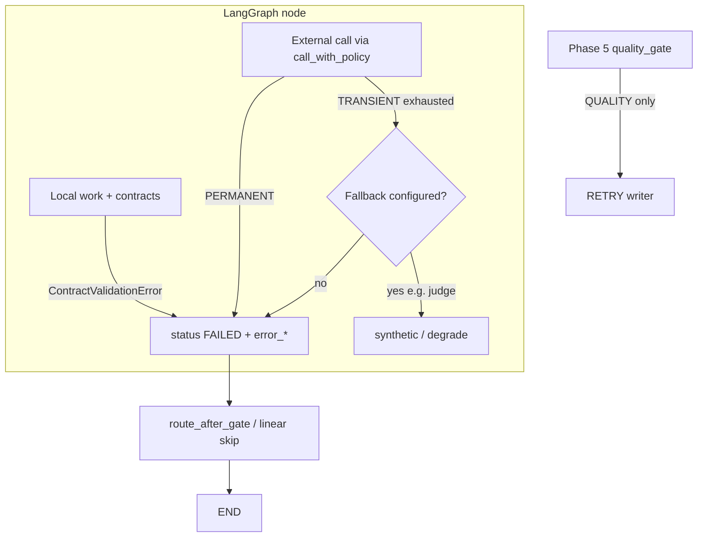

# Phase 6 — Production Failure Handling

## Master alignment
- Active stack: LangGraph only
- ADK: archive only (not a second runtime)
- Solution view: [../architecture/solution_architecture.md](../architecture/solution_architecture.md) § platform failures
- Quality loop remains Phase 5 — this phase does **not** re-open gate semantics

**Status:** Implemented (2026-08-01). Package **0.6.0**.

---

## Inspect findings (2026-08-01, post Phase 5)

| Area | Finding |
|------|---------|
| Plan | Was stub-only |
| Graph | Gate `FAILED` → END; no graph-level exception mapper |
| State | `error: str \| None` only — no class / originating node |
| Nodes | Contract errors → `FAILED`; later nodes no-op if `FAILED` |
| Quality vs infra | Phase 5 owns score retries; live judge silently falls back on any exception |
| External deps | Gemini optional; Search/MCP not wired yet |
| Config | No timeout / retry / backoff knobs |
| CLI | Exit 1 if not `COMPLETED`; `[reject]` docstring stale (now EXHAUSTED → COMPLETED) |
| Tests | No infra retry/timeout suite |

### Keep
- Fail-closed contracts
- Deterministic quality gate
- Live judge → synthetic fallback (make policy-explicit)
- Skip-if-FAILED in nodes

---

## Dependency

Phases 2–5 on disk. This phase adds **infra failure handling only**.

**One concept:** classify failures and apply **scoped** recovery (retry/backoff/timeout/fallback/propagate) around external calls.

**Out of scope:** Search/MCP servers, HITL, persistence, OTel depth (Phase 9), changing Phase 5 PASS/RETRY/EXHAUSTED rules, ADK Runner paths.

---

## Teaching (before coding)

### Two different “retries”

| Kind | Owner | Trigger | Stops when |
|------|-------|---------|------------|
| **Quality retry** | Phase 5 gate | Low score / not approved | PASS, EXHAUSTED, or contract FAIL |
| **Infra retry** | Phase 6 policy | Timeout, 429, 5xx, network blip | Max attempts or non-retryable error |

Retrying a **bad script** again without a rewrite wastes money. Retrying a **429** without backoff thrashes the API. Mixing them is the common agent-systems bug.

### Failure classes

| Class | Meaning | Typical recovery |
|-------|---------|------------------|
| **TRANSIENT** | Likely succeeds if tried again soon | Timeout + exponential backoff + hard attempt limit |
| **PERMANENT** | Same call will keep failing | Fail closed; clear user-visible error; no spin |
| **QUALITY** | Output valid but not good enough | Phase 5 gate only (rewrite loop) |
| **PROGRAMMING** | Invariant / missing state / bug | Fail immediately; do not retry; fix the code |

### Why not “retry everything”

- Amplifies cost on permanent auth failures  
- Turns malformed contracts into infinite loops  
- Hides programming bugs behind noise  
- Fights the quality gate (double loops)

**Rule:** only wrap **external I/O** (LLM/tool HTTP). Pure local code and contract validation stay fail-closed.

### Fallback vs fail-closed

| Situation | Prefer |
|-----------|--------|
| Optional live judge unavailable / exhausted retries | **Fallback** to synthetic (CI stays green; demo keeps working) |
| Required live path with no safe substitute | **Fail closed** → `FAILED` |
| Missing `generated_script` before evaluate | **Fail closed** (programming/contract) |
| Future Search blip when research is soft-dependency | **Degrade** (empty/partial notes) + continue — design later; not implemented now |

### Propagation & user-visible behavior

1. Classify at the boundary where the exception appears  
2. Write structured fields on state (`error`, `error_class`, `error_node`)  
3. Set `status=FAILED` for terminal infra/programming/permanent failures  
4. CLI: exit `1` when `status != COMPLETED` (unchanged); message should name **node + class**  
5. Do not raise out of `invoke` for expected pipeline failures — catch at node boundary

---

## Failure-mode catalog (this repo today + near future)

| Failure | Class | Retry? | Fallback / outcome | Why |
|---------|-------|--------|--------------------|-----|
| Gemini timeout / network | TRANSIENT | Yes (limited) | Judge → synthetic if still failing | Blips are common; judge is optional today |
| Gemini 429 / rate limit | TRANSIENT | Yes + backoff | Same | Needs space; immediate retry is harmful |
| Gemini 5xx | TRANSIENT | Yes + backoff | Same | Provider-side |
| Gemini 401 / 403 / bad key | PERMANENT | **No** | If offline/fallback allowed → synthetic; else FAILED | Retry cannot fix credentials |
| Empty LLM response | TRANSIENT | Yes (1–2) | Fallback / FAILED | Often flake |
| Malformed structured LLM output | TRANSIENT→PERMANENT | Re-invoke ≤ N | Fallback / FAILED | Model flake once; then stop |
| `ContractValidationError` (local parse) | PERMANENT | **No** | FAILED | Same bytes will fail again |
| Missing state (no script at evaluator) | PROGRAMMING | **No** | FAILED | Graph/invariant bug |
| Evaluator mutates script (invariant) | PROGRAMMING | **No** | FAILED | Already enforced |
| Quality score below threshold | QUALITY | Via **Phase 5 only** | RETRY/EXHAUSTED | Not an infra error |
| Uncaught exception in node body | PROGRAMMING | **No** | Catch → FAILED | Must not crash CLI uncaught |
| Google Search / MCP (not wired) | — | Policy stub only | Document; implement when Phase 12 adds tools | Avoid fake Search retries now |

---

## Target architecture

---

## Concrete design (LangGraph)

### 1. New module `failures.py`

Pure helpers (unit-testable without Gemini):

- `FailureClass` — `TRANSIENT | PERMANENT | QUALITY | PROGRAMMING`
- `FailureInfo` — `message`, `failure_class`, `node`, optional `cause_type`
- `RetryPolicy` — `max_attempts`, `timeout_seconds`, `backoff_base_seconds`, `backoff_max_seconds`
- `classify_exception(exc) -> FailureClass`  
  - Map status codes / exception types (timeout, connection, 429, 5xx → TRANSIENT; 4xx auth → PERMANENT; `ContractValidationError` → PERMANENT; unknown → PERMANENT by default)
- `call_with_policy(fn, *, policy, classify=...) -> T`  
  - Per attempt: optional timeout wrapper  
  - On TRANSIENT: sleep `base * 2^(attempt-1)` capped at max; retry until limit  
  - On PERMANENT/PROGRAMMING: raise immediately (no retry)  
  - After exhaustion: raise `RetriesExhaustedError` (TRANSIENT) for caller to fallback or fail

**No** blanket decorator on every node.

### 2. State / config

`WorkflowState` additions (optional fields, default `None`):

- `error_class: FailureClass | None` (store as str enum like other statuses)
- `error_node: str | None`

Keep `error: str | None` as human message (`[node] class: detail`).

Settings (`.env.example`):

| Knob | Default | Role |
|------|---------|------|
| `LLM_TIMEOUT_SECONDS` | `30` | Per-attempt timeout |
| `LLM_MAX_ATTEMPTS` | `3` | Total tries for TRANSIENT |
| `LLM_BACKOFF_BASE_SECONDS` | `0.5` | Exponential base |
| `LLM_BACKOFF_MAX_SECONDS` | `8` | Cap |
| `LIVE_JUDGE_FALLBACK` | `true` | After retries → synthetic |

### 3. Wire points (smallest useful)

| Call site | Policy |
|-----------|--------|
| `try_live_judge` Gemini invoke | `call_with_policy` + on exhaustion / PERMANENT-with-fallback → `None` → synthetic (existing) |
| Future live scriptwriter / research tools | Same helper when added — **not** inventing Search client this phase |
| Node entry | `try/except Exception` → map to `FAILED` + `FailureInfo` (programming/unknown) so `invoke` stays calm |

Contract failures: **unchanged** path (no infra retry).

### 4. CLI / docs

- Fix `__main__` docstring: `[reject]` → EXHAUSTED → COMPLETED (exit 0); real infra/contract FAIL → exit 1  
- JSON dump includes `error_class` / `error_node` when set

### 5. Explicit non-goals this phase

- No LangGraph `RetryPolicy` middleware graph rewrite (helper is enough and clearer for learning)  
- No real Google Search client  
- No changing `QUALITY_THRESHOLD` / max_iterations  
- No full observability stack (log `failure_class` + `node` with existing logger only)

---

## Tests (`tests/test_failures.py`)

1. `classify`: timeout/429-like → TRANSIENT; auth → PERMANENT; `ContractValidationError` → PERMANENT  
2. `call_with_policy`: succeeds on 2nd attempt (mock)  
3. Exhausts after `max_attempts` without infinite loop  
4. PERMANENT error: single attempt only  
5. Live judge path: mocked transient then success; mocked all-fail → synthetic when fallback on  
6. Node boundary: forced exception → `status=FAILED`, `error_class` set, graph `invoke` returns state (no traceback exit)  
7. Regression: `[reject]` still completes via Phase 5 EXHAUSTED (quality path untouched)  
8. Regression: happy-path still COMPLETED  

CI: no live Gemini required.

---

## Implementation order (after Approve)

1. `failures.py` + config knobs + state fields  
2. Wire `try_live_judge` + node-boundary catch helper used by nodes  
3. Tests + CLI docstring fix  
4. Version bump `0.6.0`  
5. Verify: `ruff`, `pytest`, CLI smokes  

---

## Approval gate

Implement only after explicit:

- “Approve Phase 6 design — implement”  
- or “Approved, proceed with implementation”

Master index: [00_master_learning_roadmap_24e99839.plan.md](00_master_learning_roadmap_24e99839.plan.md).
