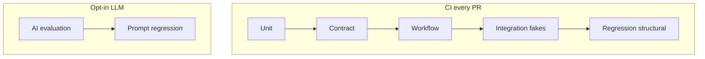
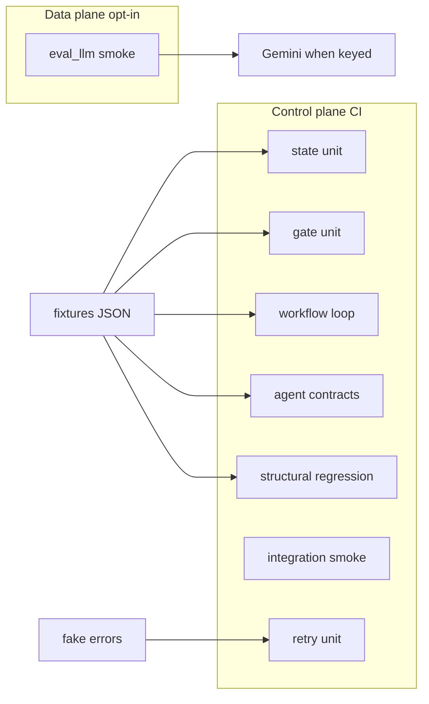

# Phase 7 — Test Strategy for Agentic AI


## Master alignment
- Active stack: LangGraph only
- ADK: archive only (not a second runtime)
- If this plan still describes ADK APIs below, treat them as historical; redesign for LangGraph in Steps 2–3 of the phase loop

## Scope lock

- One concept: **test strategy and test layout** for this repo (LangGraph-only active stack)
- Prefer organizing/extending tests for Phases 2–6 behaviors; do not redesign graph topology here
- Do **not** require live Gemini for CI-default suite
- Do **not** assert exact LLM prose
- Phase 6 is **done** (`failures.py` + `tests/unit/test_failures.py`) — retry-policy unit coverage already exists; Phase 7 organizes/marks/documents rather than re-inventing it

**Status:** Implemented (2026-08-01). Package **0.7.0**. CI: `pytest -m "not llm"`.

## Inspect findings (2026-08-01, post Phase 6)

| Area | Finding |
|------|---------|
| Layout | Flat `tests/test_*.py` — **no** `unit/` `contract/` `workflow/` `integration/` `regression/` `eval_llm/` |
| conftest | **Missing** — no shared fixture loaders / markers |
| pytest config | `[tool.pytest.ini_options]` in `pyproject.toml` has `testpaths` + `pythonpath`; **no** `markers` / `addopts` for `-m "not llm"` |
| Count | **60** tests collected; all offline (demo producers / synthetic judge / mocks) |
| Coverage present | State, schemas/contracts, evaluator merge, quality loop (1–7), failures/retry, config, util, graph invoke |
| Retries | `tests/test_failures.py` already covers classify / backoff / exhaust / fallback / node boundary |
| AI eval | **No** `tests/eval_llm/`; **no** active `evals/` (only `archive/adk_baseline/evals/`) |
| README | Documents `pytest -q` only — not CI vs LLM / pyramid story |
| Brittleness | Mostly OK; demo-marker assert `"Addressed feedback" in body` is intentional control-plane marker, not live LLM prose |
| Duplication | Several graph invoke “happy path COMPLETED” tests across files |
| Checkpointer | No integration tests with MemorySaver / fake checkpointer (Phase 10 not started) |

### What already exists (map to pyramid)

| Pyramid layer | On disk today |
|---------------|---------------|
| Unit | `test_workflow_state`, `test_failures` (policy), parts of `test_evaluator` / `test_quality_loop` (pure gate), `test_config`, `test_util` |
| Contract | `test_contracts`, `test_schemas`, evaluator “no mutate script” |
| Workflow | `test_quality_loop` graph + gate scenarios |
| Integration | Light: `test_graph_imports` / invoke with demo nodes (not checkpointer) |
| Regression | Implicit via fixtures `high_quality.json` / `poor_quality.json` — no dedicated folder |
| AI eval (`llm`) | **Absent** |

### Gaps this phase must close

1. Package layout + `conftest.py` + `llm` marker + default `not llm` docs/CI command  
2. Relocate (not rewrite) existing tests into pyramid folders; avoid needless duplication  
3. Thin `tests/eval_llm/` stub(s) marked `llm` (skip without key) — full dataset is Phase 8  
4. README: deterministic vs probabilistic + how to run each suite  
5. Optional: one structural regression home for fixture scripts; do **not** build offline eval harness (Phase 8)

---

## Teaching: deterministic tests vs probabilistic AI evaluation

| | Deterministic software tests | Probabilistic AI evaluation |
|--|------------------------------|-----------------------------|
| Question | Did the **system** behave correctly? | Did the **model** produce acceptable quality? |
| Inputs | Fixtures, fakes, injected scores | Real or recorded model outputs |
| Assertions | Exact state transitions, schemas, retries | Rubric thresholds, pass rates, regressions |
| Stability | Must be 100% repeatable in CI | Flaky by nature; measure over N runs |
| Failure meaning | Bug in our code | Model/prompt drift or task hardness |

They **complement** each other:

- Unit/workflow/contract tests lock **control plane** (state, gates, loops, retries, schemas).
- AI eval tests track **data plane** quality (scripts that humans would accept).
- Never replace one with the other: a green rubric can hide a broken max-iteration bug; a perfect gate can still ship bad scripts if prompts regress.

---

## What should and should not call a real LLM

| Layer | Real LLM? | Why |
|-------|-----------|-----|
| Unit | **No** | Pure functions, schemas, gate logic |
| Contract | **No** | Validate shapes / graph wiring metadata |
| Workflow | **No** | Drive loop with fake eval scores |
| Integration (graph invoke + checkpointer/memory) | **No** by default; optional recorded fakes | Exercise graph invoke without tokens |
| Retries / failure injection | **No** | Fake transport / raised errors |
| AI evaluation | **Yes** (opt-in / nightly) | Needs model judgment or generation |
| Regression (prompt) | **Yes** opt-in + golden structure checks | Detect prompt drift; assert structure not wording |

**CI default:** `pytest -m "not llm"` (or exclude `tests/eval_llm/`).  
**Nightly / manual:** `pytest -m llm` with API key.

---

## Test pyramid for this repo



### 1. Unit tests

**What:** `WorkflowState`, `apply_quality_gate`, `merge_evaluation`, `deterministic_checks`, `parse_contract`, retry classifier/backoff helpers, `sanitize_input`.

**Where:** `tests/unit/`

**LLM:** never

### 2. Integration tests

**What:** Compiled graph + in-memory checkpointer (prefer memory for tests even if prod uses SQLite/Postgres) with **fake/stub nodes** or monkeypatched model calls; config loading from env.

**Where:** `tests/integration/`

**LLM:** never in CI

### 3. Workflow tests

**What:** Full control-plane scenarios — pass/fail/retry/exhaust/terminate; best_script preservation; iteration caps (Phase 5 tests 1–7).

**Where:** `tests/workflow/test_quality_loop.py`

**LLM:** never — inject `ScriptEvaluation` fixtures

### 4. Contract tests

**What:**

- Pydantic: `ShortScript`, `VisualPlan`, `ScriptEvaluation`, `ShortConcept`
- Node wiring: state keys / structured outputs; evaluator does not write `generated_script`
- Graph shape: quality-loop conditional edges then Visualizer/Formatter

**Where:** `tests/contract/`

**LLM:** never

### 5. AI evaluation tests

**What:** Small eval set (3–5 ideas); run generator and/or judge; assert **structural** pass criteria (has hook/CTA, duration band, `approved` rate) and score thresholds — **not** exact text match.

**Where:** `tests/eval_llm/` + reuse [`evals/`](evals/) 

**LLM:** yes, marked `@pytest.mark.llm`

### 6. Regression tests

**Two flavors:**

| Flavor | LLM? | Assert |
|--------|------|--------|
| Structural regression | No | Fixtures of past `ShortScript`/`ScriptEvaluation` still validate; gate decisions unchanged |
| Prompt regression | Yes, opt-in | Same seeds/ideas → schema-valid output; no collapse of required fields |

**Where:** `tests/regression/`

**Brittle wording:** forbidden (`assert "Stop writing agents" in text` on model output).

---

## Concrete tests to create/organize

Map required coverage to files:

| Area | Tests | Layer |
|------|-------|-------|
| State | initial, valid update, missing, invalid | unit |
| Quality gate | PASS/RETRY/EXHAUSTED/FAIL | unit + workflow |
| Loop | graph max_iterations=3; retry path | workflow + contract |
| Termination | pass immediate; max stop | workflow |
| Retries | transient 429/5xx retry; permanent 401 no retry; exhaust | unit (Phase 6 policy) |
| Structured outputs | valid/malformed scripts & evals | contract |
| Agent contracts | keys/schemas/no script mutation by evaluator | contract |

Reuse Phase 4–5 fixtures under `tests/fixtures/`.

---

## Mocks and fakes (appropriate use)

| Fake | Use |
|------|-----|
| Fixture `ShortScript` / `ScriptEvaluation` | Gate & loop |
| `FakeEvaluationSequence` | Yield fail, fail, pass scores across iterations |
| `RecordingQualityGate` / pure `apply_quality_gate` | Assert decisions & logs |
| Fake exception types (`RateLimitError`, `TimeoutError`) | Retry policy |
| In-memory checkpointer / fake nodes | Integration without SQLite files |
| **Do not** mock Pydantic away | Contracts are the point |
| **Do not** snapshot full LLM essays | Brittleness |

---

## Pytest layout and markers

```text
tests/
  unit/
  contract/
  workflow/
  integration/
  regression/
  eval_llm/          # mark llm
  fixtures/
conftest.py          # markers, fixture loaders
```

```python
# pyproject.toml / pytest.ini
markers =
  llm: calls a real LLM; excluded from default CI
```

Default CI command: `pytest -m "not llm"`.

---

## Failure-handling tests (Phase 6 — already satisfied)

`tests/test_failures.py` already covers classified retry (429/5xx/timeout), permanent 401, exhaust, live-judge fallback (mocked), node-boundary → FAILED. **Move** to `tests/unit/test_failures.py`; do not rewrite.

---

## Concrete design (for Approve)

### Target tree

```text
tests/
  conftest.py                 # markers note + load_script_fixture helper
  fixtures/scripts/           # unchanged JSON fixtures
  unit/
    test_workflow_state.py    # pure state only (drop graph invoke → integration)
    test_failures.py
    test_evaluator.py         # deterministic_checks / merge / synthetic (no invoke)
    test_config.py
    test_util.py
  contract/
    test_contracts.py
    test_schemas.py
    test_agent_invariants.py  # evaluator never writes generated_script (extract if needed)
  workflow/
    test_quality_loop.py      # gate cases 1–7 + graph retry/exhaust markers
  integration/
    test_graph_smoke.py       # compile + offline invoke COMPLETED (dedupe happy paths)
  regression/
    test_fixture_scripts.py   # high/poor JSON still validate + gate decisions stable
  eval_llm/
    test_live_judge_smoke.py  # @pytest.mark.llm; skip without GOOGLE_API_KEY
```

### File move map (git mv / relocate — minimal logic change)

| From | To | Notes |
|------|----|-------|
| `test_workflow_state.py` | `unit/test_workflow_state.py` | Move `test_graph_invoke_*` → `integration/` or delete if covered by smoke |
| `test_failures.py` | `unit/test_failures.py` | Keep; graph happy/reject can stay or rely on workflow |
| `test_evaluator.py` | `unit/test_evaluator.py` | Keep node unit tests here |
| `test_config.py` | `unit/test_config.py` | |
| `test_util.py` | `unit/test_util.py` | |
| `test_contracts.py` | `contract/test_contracts.py` | |
| `test_schemas.py` | `contract/test_schemas.py` | |
| `test_quality_loop.py` | `workflow/test_quality_loop.py` | |
| `test_graph_imports.py` | `integration/test_graph_smoke.py` | Rename; single happy-path invoke + version + keys |
| *(new)* | `regression/test_fixture_scripts.py` | Thin: fixtures parse; optional gate on fixture scores |
| *(new)* | `eval_llm/test_live_judge_smoke.py` | Opt-in only |

### Pytest / conftest

`pyproject.toml`:

```toml
[tool.pytest.ini_options]
asyncio_mode = "auto"
testpaths = ["tests"]
pythonpath = ["src"]
markers = [
  "llm: calls a real LLM; excluded from default CI",
]
# Do NOT set addopts = "-m 'not llm'" globally if that surprises local `pytest -q`;
# document CI command instead. Optional later: addopts once team agrees.
```

`tests/conftest.py`:

- Document marker (pytest also reads pyproject)  
- `FIXTURES_DIR` + `load_script_fixture(name) -> ShortScript`  
- Autouse or helper: for `@pytest.mark.llm` tests, `pytest.skip` if no `GOOGLE_API_KEY` and not Vertex  

### `eval_llm` stub (Phase 7 only — not Phase 8 harness)

One smoke test:

- Marked `@pytest.mark.llm`  
- Skips without credentials  
- Calls `try_live_judge` or `judge_script(..., prefer_live=True)` on a fixture script  
- Asserts: returns `ScriptEvaluation`, scores in 0–10, has `summary` — **no** exact wording  

Full offline dataset / pass-rate harness → **Phase 8**.

### Dedup rule

Keep **one** offline graph happy-path in `integration/test_graph_smoke.py`. Remove duplicate COMPLETED invokes from unit/workflow/failures where redundant (keep workflow marker scenarios: `[retry-pass]`, `[reject]`).

### README (Tests section)

- Control plane: `pytest -m "not llm" -q` (or plain `pytest -q` until llm tests exist and are skipped)  
- Data plane: `pytest -m llm -q` (needs key)  
- Short paragraph: deterministic tests vs AI eval complementarity  
- Pyramid folder list under Project layout  

### Version

Bump package to **0.7.0** after layout lands.

### Out of scope

- MemorySaver / Postgres checkpointer tests (Phase 10)  
- Offline evalset harness + `evals/` dataset (Phase 8)  
- Playwright / browser e2e  
- Redesigning graph or prompts  
- Brittle snapshot of live model prose  

---

## Implementation order (after Approve)

1. `pyproject.toml` markers + `tests/conftest.py`  
2. Create folders; move files per map; fix imports if any  
3. Add regression + eval_llm stubs  
4. Dedup happy-path invokes  
5. README + version `0.7.0`  
6. Verify: `ruff`, `pytest -m "not llm" -q` green; `pytest -m llm` skips without key  

### Resulting test architecture



## Exit criteria

- Six kinds visible in `tests/` layout  
- CI-default suite never needs a real LLM  
- Coverage retained: state, gate, loop, termination, retries, structured outputs, agent contracts  
- No brittle exact-wording assertions on **live** model text  
- README documents pyramid + `not llm` vs `llm`  

## Approval gate

Implement only after explicit:

- “Approve Phase 7 design — implement”  
- or “Approved, proceed with implementation”
