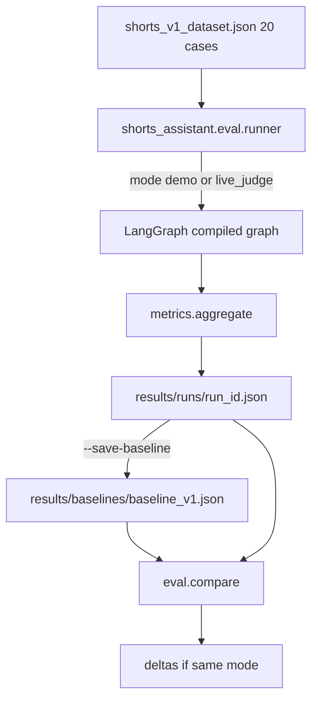

# Phase 8 — Build an AI Evaluation Dataset


## Master alignment
- Active stack: LangGraph only
- ADK: archive only (not a second runtime)
- If this plan still describes ADK APIs below, treat them as historical; redesign for LangGraph in Steps 2–3 of the phase loop

## Scope lock

- One concept: **evaluation dataset + baseline runner + metrics store**
- Do **not** optimize prompts or change models to chase scores
- Do **not** require these runs in default CI (`@pytest.mark.llm` / separate CLI)
- Stay on the LangGraph workflow already defined (Phases 2–7)
- Depends on: structured `ScriptEvaluation`, quality loop fields (`iteration`, pass/fail), runnable pipeline

**Status:** Implemented (2026-08-01). Package **0.8.0**. Dual-mode: `demo` | `live_judge`.

## Inspect findings (2026-08-01, post Phase 7)

| Area | Finding |
|------|---------|
| Active `evals/` | **Missing** — architecture expects `evals/`; only ADK archive has evalsets |
| ADK archive | `archive/adk_baseline/evals/shorts_concept.evalset.json` — ~3 conversation cases, ADK `session_input` shape; not reusable as LangGraph dataset |
| Pipeline today | Nodes use **demo producers** + `judge_script(..., prefer_live=False)` — offline graph invoke ≠ live model quality |
| Live LLM surface | `try_live_judge` exists; scriptwriter/research/visualizer are still demo heuristics |
| Phase 7 | One `@pytest.mark.llm` smoke on live judge only — not a 20-case harness |
| Runner / compare | **No** `eval_runner`, `eval_compare`, metrics aggregator, or `results/` |
| Fixtures | `tests/fixtures/scripts/` = contract fixtures, not an eval case dataset |
| CI | Correctly offline via `pytest -m "not llm"`; no nightly eval docs yet |
| Plan drift | Mentions ADK `root_agent` / package path — redesign for `shorts_assistant` + LangGraph |

### Critical design tension (for Understand)

A true “did v2 improve?” baseline needs **live generation and/or live judging**. Today the default graph cannot produce live scripts. Phase 8 options to decide in Review:

1. **Offline harness + synthetic scores** — runnable now; baselines measure demo/heuristic behavior (weak signal for prompt work)  
2. **Live-judge-only** — demo scripts + `prefer_live=True` judge — measures judge+criteria, not writer quality  
3. **Live path flag for eval** — wire optional live scriptwriter/judge for `eval_runner` only (smallest live baseline)  

Recommend stating the chosen option explicitly before Approve (default lean: harness works offline with injectable runner; CLI supports `--live` when credentials exist, documenting that demo mode baselines are for harness validation, live mode for model baselines).

### Gaps this phase must close

1. Author `evals/shorts_v1_dataset.json` (20 cases, LangGraph schema)  
2. Implement `eval_runner` + aggregate metrics + continue-on-failure  
3. Baseline save + `eval_compare` deltas  
4. Deterministic `tests/eval_harness/` (load/metrics/compare/dry-run)  
5. README: manual/nightly how-to; not default CI; no prompt optimization  

---

## Teaching: why baseline first

You cannot answer “did v2 improve?” without a **fixed case set**, **fixed metrics**, and a **frozen baseline artifact**.

```text
dataset (constant)
  → runner (constant harness)
  → metrics (constant definitions)
  → baseline.json (v1 snapshot)
  → later: candidate.json (v2) → compare deltas
```

Optimizing prompts before a baseline creates **unanchored tinkering**: scores move, but you do not know if the task distribution or the harness changed.

---

## Dataset design (20 cases)

**File:** [`evals/shorts_v1_dataset.json`](evals/shorts_v1_dataset.json)  
(Replace/expand the thin smoke evalset; own a schema suited to the LangGraph harness — ADK field names are historical only.)

### Case schema

```json
{
  "case_id": "dev_adk_intro",
  "input": {
    "topic": "How to build AI agents with Google ADK",
    "audience": "developers",
    "constraints": ["under 60 seconds", "no hype"]
  },
  "expected_characteristics": [
    "names ADK or agent workflow concepts",
    "clear hook in first lines",
    "explicit CTA"
  ],
  "quality_criteria": {
    "min_overall_score": 7.0,
    "require_approved": true,
    "max_duration_seconds": 60,
    "must_include_sections": ["hook", "body", "cta"]
  },
  "known_failure_patterns": [
    "generic AI hype without ADK specifics",
    "missing CTA",
    "overlong duration estimate"
  ],
  "tags": ["framework", "intro", "tooling"]
}
```

### Case mix (20) — concrete distribution

| Count | Category | Intent |
|------:|----------|--------|
| 4 | Framework/tool intro (ADK, FastAPI, pytest, Docker basics) | Happy path educational |
| 3 | Abstract concept (DI, eventual consistency, CAP lite) | Clarity under abstraction |
| 3 | How-to / steps (env config, logging, CI basics) | Pacing / structure |
| 3 | Comparison (REST vs gRPC, SQL vs NoSQL — carefully scoped) | Technical accuracy risk |
| 2 | Trendy/hype-prone (AI agents, “10x productivity”) | Tone / anti-hype |
| 2 | Narrow API feature (pydantic-settings, asyncio gather) | Specificity |
| 2 | Ambiguous / underspecified topic | Robustness / ask-clarity in script |
| 1 | Adversarial / off-niche (“best crypto pumps”) | Should stay professional or low score |

Exact `case_id`s will be listed in the JSON; topics stay developer-Shorts scoped.

**No expected full script text** — only characteristics and criteria (avoids brittle wording).

---

## Evaluation runner

**CLI:** `python -m <langgraph_package>.eval_runner --dataset evals/shorts_v1_dataset.json --out evals/results/` (package name from Phase 1 skeleton)

**Module:** [`eval_runner.py`](eval_runner.py)

### Per-case execution

1. Init `WorkflowState` with topic as `request`/`raw_idea`  
2. Run existing pipeline (or script-loop only if visuals make eval too slow — **default: full root_agent**, with flag `--stage script_loop` for cheaper baselines)  
3. Capture final state: `evaluation`, `iteration`, `status`, `best_score`, errors  
4. Record wall time, model name, git commit / `run_id`, prompt bundle version string (filename hash or constant `prompt_version`)

### Per-case record

```json
{
  "case_id": "...",
  "ok": true,
  "overall_score": 8.1,
  "hook_score": 8.5,
  "clarity_score": 8.0,
  "technical_accuracy": 7.5,
  "factual_correctness": 7.0,
  "developer_value": 8.0,
  "pacing_score": 7.5,
  "duration_score": 8.0,
  "cta_score": 8.0,
  "approved": true,
  "iterations": 2,
  "revised": true,
  "failed": false,
  "error": null,
  "criteria_pass": true
}
```

`revised = iterations > 1`  
`failed = runner/agent hard failure OR missing evaluation`  
`criteria_pass =` dataset thresholds vs actual scores/structure

---

## Aggregate metrics

Produced in `summary.json`:

| Metric | Definition |
|--------|------------|
| `average_quality` | mean `overall_score` over cases with an evaluation |
| `avg_hook_score` | mean hook |
| `avg_accuracy` | mean of `technical_accuracy` and `factual_correctness` |
| `avg_clarity` | mean `clarity_score` |
| `pass_rate` | fraction `criteria_pass` |
| `approval_rate` | fraction `approved` |
| `revision_rate` | fraction `iterations > 1` |
| `average_iterations` | mean `iterations` |
| `failure_rate` | fraction hard failures / missing eval |
| `exhaustion_rate` | fraction `status == EXHAUSTED` |

Also store `n_cases`, `model_name`, `quality_threshold`, `created_at`, `git_sha` if available.

---

## Baseline storage (comparison later)

```text
evals/
  shorts_v1_dataset.json          # immutable cases for v1 lineage
  results/
    baselines/
      baseline_v1.json            # frozen summary + per-case (copy)
    runs/
      {run_id}.json               # each new run
  compare.py                      # optional small diff helper
```

**Baseline command:**

```bash
python -m youtube_shorts_assistant.eval_runner \
  --dataset evals/shorts_v1_dataset.json \
  --out evals/results/runs \
  --save-baseline evals/results/baselines/baseline_v1.json
```

**Compare (Phase 8 ships minimal comparator, no prompt tuning):**

```bash
python -m youtube_shorts_assistant.eval_compare \
  --baseline evals/results/baselines/baseline_v1.json \
  --candidate evals/results/runs/<run_id>.json
```

Print deltas: pass_rate, average_quality, failure_rate, average_iterations.

Answer shape: **“v2 − v1 on fixed dataset/harness.”**

---

## What calls a real LLM

| Component | Mode | LLM? |
|-----------|------|------|
| Dataset JSON authoring | — | No |
| Eval runner `--mode demo` | default | **No** (demo producers + synthetic judge) |
| Eval runner `--mode live_judge` | opt-in | **Yes** (judge only) |
| Metrics / compare | — | No |
| Default CI | — | **No** |

Document: live baselines are **manual/nightly**; demo mode validates the harness anytime.

---

## Concrete design (for Approve)

### Decision: dual-mode runner (chosen)

| Mode | Flag | Writers | Judge | Purpose |
|------|------|---------|-------|---------|
| **demo** | `--mode demo` (default) | demo producers | synthetic | Harness tests + offline dry baseline |
| **live_judge** | `--mode live_judge` | demo producers | Gemini via `prefer_live=True` | First real model signal without building live writer yet |

**Why not full live writer in Phase 8:** scriptwriter is still demo; wiring a production writer is a larger phase. Live judge still answers “did judge/criteria/prompts for evaluation drift?” and proves the baseline/compare loop. Label every run with `"mode"` so demo vs live baselines are never compared accidentally (`eval_compare` refuses mismatched modes).

**Out of scope:** live scriptwriter, prompt tuning, model sweeps.

### Package layout

```text
evals/
  shorts_v1_dataset.json
  results/
    baselines/.gitkeep          # user/nightly writes baseline_v1.json
    runs/.gitignore             # ignore run artifacts (keep dir)
src/shorts_assistant/eval/
  __init__.py
  __main__.py                   # python -m shorts_assistant.eval …
  dataset.py                    # load/validate cases
  metrics.py                    # aggregate + criteria_pass
  runner.py                     # per-case invoke, continue on failure
  compare.py                    # baseline vs candidate deltas
tests/eval_harness/             # deterministic only
```

CLI:

```bash
# Offline harness run (CI-safe)
PYTHONPATH=src python -m shorts_assistant.eval run \
  --dataset evals/shorts_v1_dataset.json \
  --out evals/results/runs \
  --mode demo

# Nightly / manual model signal
PYTHONPATH=src python -m shorts_assistant.eval run \
  --dataset evals/shorts_v1_dataset.json \
  --out evals/results/runs \
  --mode live_judge \
  --save-baseline evals/results/baselines/baseline_v1.json

PYTHONPATH=src python -m shorts_assistant.eval compare \
  --baseline evals/results/baselines/baseline_v1.json \
  --candidate evals/results/runs/<run_id>.json
```

Optional `--stage script_loop` later; **Phase 8 default = full compiled graph** (research → loop → visual → format) so status/iterations match production path.

### Live-judge wiring (smallest change)

Eval runner does **not** change default CLI product behavior. For `--mode live_judge` only:

- Build/compile graph as usual OR invoke with a thin wrapper that temporarily runs evaluator with `prefer_live=True` (e.g. monkeypatch `judge_script` default / pass context). Prefer an explicit injectable `run_case(topic, *, prefer_live: bool)` helper used by runner — keep `nodes.evaluator_node` calling `judge_script(..., prefer_live=...)` from a module-level/settings/eval flag cleared after run.

Chosen approach: `shorts_assistant.eval.runner` sets a contextvar or `settings`-scoped flag `eval_prefer_live` read by `evaluator_node` — **only** when runner enables it. Default remains `False`.

### Dataset: 20 case_ids (LangGraph schema)

File: `evals/shorts_v1_dataset.json` with `version`, `dataset_id: shorts_v1`, `cases: [...]`.

| # | case_id | Category |
|--:|---------|----------|
| 1 | `fw_langgraph_intro` | Framework intro |
| 2 | `fw_fastapi_basics` | Framework intro |
| 3 | `fw_pytest_fixtures` | Framework intro |
| 4 | `fw_docker_basics` | Framework intro |
| 5 | `abs_dependency_injection` | Abstract concept |
| 6 | `abs_eventual_consistency` | Abstract concept |
| 7 | `abs_cap_theorem_lite` | Abstract concept |
| 8 | `howto_env_config` | How-to |
| 9 | `howto_structured_logging` | How-to |
| 10 | `howto_ci_smoke` | How-to |
| 11 | `cmp_rest_vs_grpc` | Comparison |
| 12 | `cmp_sql_vs_nosql` | Comparison |
| 13 | `cmp_sync_vs_async` | Comparison |
| 14 | `hype_ai_agents` | Hype-prone |
| 15 | `hype_10x_productivity` | Hype-prone |
| 16 | `narrow_pydantic_settings` | Narrow API |
| 17 | `narrow_asyncio_gather` | Narrow API |
| 18 | `ambig_make_it_better` | Ambiguous |
| 19 | `ambig_optimize_this` | Ambiguous |
| 20 | `adv_crypto_pumps` | Adversarial / off-niche |

Each case: `input.topic`, optional `audience`/`constraints`, `expected_characteristics[]`, `quality_criteria`, `known_failure_patterns[]`, `tags[]`. **No** expected full script text.

`criteria_pass` rules (deterministic):

- `overall_score >= min_overall_score` (if evaluation present)  
- `approved == true` when `require_approved`  
- `estimated_duration_seconds <= max_duration_seconds` when script present  
- required section labels present on script  
- Soft characteristics are **documentation only** in v1 (not string-matched) — avoids brittle wording

### Per-case + summary (unchanged metrics table above)

Plus required fields: `mode`, `model_name`, `run_id`, `created_at`, `n_cases`, `prompt_version` (constant e.g. hash of `prompts/*.txt` names or `"v0.8-demo"`).

`eval_compare`: delta on `pass_rate`, `average_quality`, `failure_rate`, `average_iterations`, `approval_rate`; **error if baseline.mode != candidate.mode**.

### Tests (`tests/eval_harness/`)

- Dataset: 20 cases, required keys, unique `case_id`  
- Metrics: fixture records → expected averages/rates  
- Compare: known deltas; mode mismatch raises  
- Runner dry-run: inject stub `invoke_case` returning fake states — no Gemini  

### Git / artifacts

- Commit: `evals/shorts_v1_dataset.json`, `results/baselines/.gitkeep`, `results/runs/.gitignore`  
- Do **not** require committing a live baseline in-repo (user generates)  
- Optional: commit a tiny **demo** baseline from harness stub for docs — only if clearly named `baseline_demo_v1.json`

### Version / docs

- Package **0.8.0**  
- README: baseline-first story; `demo` vs `live_judge`; never optimize prompts in this phase  

### Out of scope

- Prompt edits, temperature sweeps, live scriptwriter, 100+ cases, CI-blocking eval, human annotation UI, ADK evalset format  

---

## Architecture



---

## Implementation order (after Approve)

1. Dataset JSON (20 cases) + results dirs / gitignore  
2. `eval/dataset.py`, `metrics.py`, `runner.py`, `compare.py`, `__main__.py`  
3. Minimal `evaluator_node` prefer_live hook for eval mode only  
4. `tests/eval_harness/`  
5. README + version `0.8.0`  
6. Verify: `pytest -m "not llm"` green; dry `eval run --mode demo` on dataset  

## Exit criteria

- 20 cases with input, characteristics, criteria, failure patterns  
- Runner produces per-case + summary metrics; continue-on-failure  
- Baseline + compare answer “did v2 improve?” **within the same mode**  
- No prompt optimization in this phase  

## Approval gate

Implement only after explicit:

- “Approve Phase 8 design — implement”  
- or “Approved, proceed with implementation”
