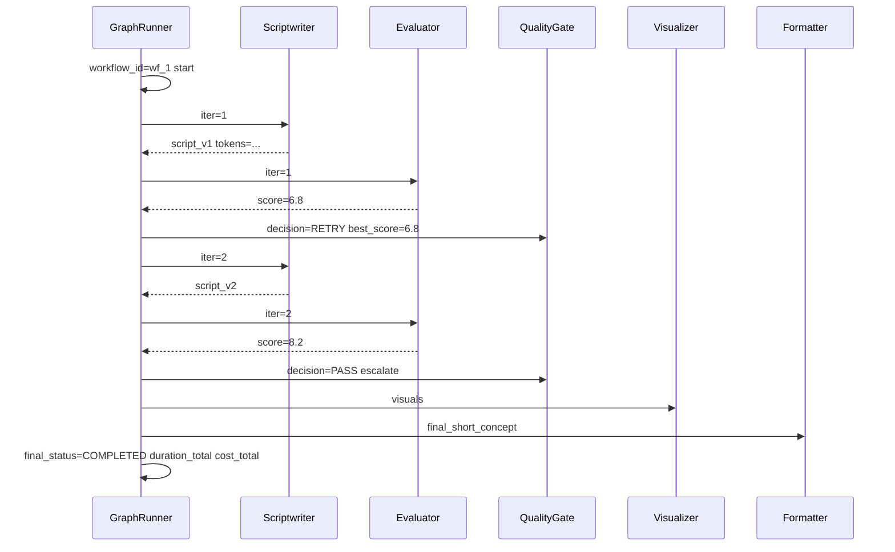
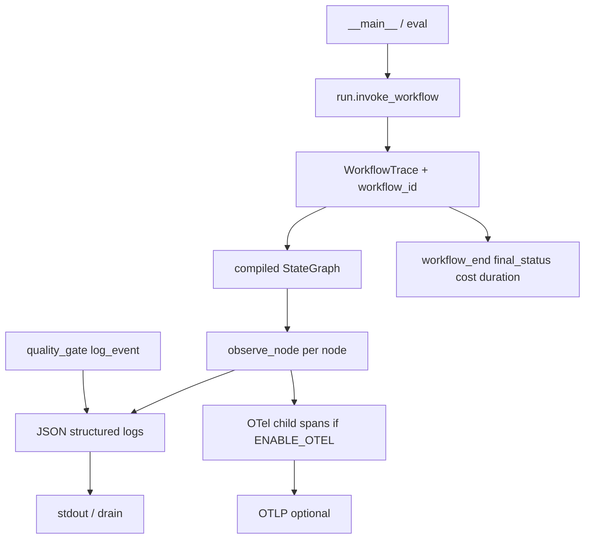

# Phase 9 — AI Observability


## Master alignment
- Active stack: LangGraph only
- ADK: archive only (not a second runtime)
- If this plan still describes ADK APIs below, treat them as historical; redesign for LangGraph in Steps 2–3 of the phase loop

## Scope lock

- One concept: **traceable workflow observability**
- Instrument the existing LangGraph pipeline; do not add a new orchestrator
- Default: structured logs with `workflow_id` (always on)
- OpenTelemetry: **opt-in** after rationale below (env-gated; new LangGraph-safe `telemetry.py` — do **not** reuse ADK `maybe_set_otel_providers`)
- Do **not** log API keys, raw `.env`, or full prompt files by default
- Depends on: quality loop (iteration/scores), CLI/`eval` entrypoints, Phase 6 retry policy

**Status:** Implemented (2026-08-01). Package **0.9.0**.

## Inspect findings (2026-08-01, post Phase 8)

| Area | Finding |
|------|---------|
| `observability.py` | **Missing** in `src/shorts_assistant/` |
| Active OTel | **Missing** — `ENABLE_OTEL` in config/`.env.example` but never wired |
| Archive telemetry | `archive/adk_baseline/telemetry.py` calls **ADK** `maybe_set_otel_providers` — not usable for LangGraph product |
| Logging today | Ad-hoc `logger.info/warning` in gate, failures, judge, util, eval runner — plain text, **no** `workflow_id` |
| Logging setup | No `basicConfig` / JSON formatter / context filter in active package |
| State | No `workflow_id` (or run_id) on `WorkflowState` |
| Timing / tokens / cost | Not captured; live judge does not extract usage metadata |
| Node hooks | Nodes return dicts only — no start/end timing wrapper or LG callbacks |
| CLI / eval | `__main__.py` and `eval.runner` invoke graph with no trace lifecycle |
| Privacy | No redaction helpers; risk of logging secrets if someone dumps state |
| Plan drift | References root `telemetry.py` / `runner.py` — redesign for `shorts_assistant` |

### What already exists (keep / extend)

- `LOG_LEVEL`, `ENABLE_OTEL` config knobs (unused beyond storage)
- Gate logs decision inputs (iteration, scores) — unstructured
- Phase 6 `call_with_policy` attempt logs — no correlated `workflow_id`
- Eval run artifacts have `run_id` (eval-only; not product CLI)

### Gaps this phase must close

1. `observability.py`: `workflow_id` contextvars, structured events, cost helper, redaction  
2. Wire CLI + graph invoke path (and optionally eval runner) with start/end summary  
3. Per-node timing via thin wrappers or graph callbacks — fail-open if obs errors  
4. Opt-in OTel spans (stdlib/OTLP), **not** ADK telemetry  
5. Config: cost rates, `LOG_PAYLOADS=false`; unit tests + README 6.8→8.2 narrative  

---

## Teaching: why observability for agentic systems

LLM apps fail in ways metrics-only APIs miss:

- Which **iteration** produced the bad script?
- Did cost spike from **retries** or from the quality loop?
- Did the **evaluator** or **scriptwriter** fail?
- Was score 6.8 → 8.2 expected revision, or stuck retrying?

Logs/traces turn “the short was weird” into “Attempt 1 scored 6.8, Attempt 2 passed at 8.2, visualizer 1.2s, total $0.01.”

### Why OpenTelemetry (and when)

| Approach | Role |
|----------|------|
| Structured logs (`workflow_id`, JSON fields) | Fast to adopt; enough for local + many prod setups |
| OpenTelemetry traces/spans | Standard export to Jaeger/Cloud Trace/Grafana; parent/child spans for agents |
| Full “AI obs platform” (LangSmith, etc.) | Rich prompt/playground UX — **deferred** unless you later need prompt diffs SaaS |

**Decision:**  

1. **Mandatory:** structured logging + `workflow_id` correlation  
2. **Opt-in:** OTel spans via `ENABLE_OTEL=true` / OTLP endpoint (extend [`telemetry.py`](telemetry.py))  
3. **Not yet:** paid AI observability SaaS (avoid vendor lock-in while learning LangGraph obs)

OTel earns its place when you need **cross-service** or **span UI** timelines; logs alone still answer most Single-service debugging.

---

## What to capture (every execution)

| Field | Source |
|-------|--------|
| `workflow_id` | UUID at runner start; bind to logging context |
| `agent` / `node` | LangGraph node name |
| `start_time` / `duration_ms` | span or timer around agent / workflow |
| `model` | `settings.model_name` |
| `input_tokens` / `output_tokens` | From Gemini/langchain usage metadata when present; else `null` |
| `estimated_cost_usd` | Simple rate table in config (configurable per 1M tokens); `null` if tokens missing |
| `iteration` | `WorkflowState.iteration` |
| `evaluation_score` | `evaluation.overall_score` when available |
| `retry_count` | From Phase 6 resilience counters (default 0 if absent) |
| `error` | Exception type + safe message (no key material) |
| `final_status` | PASSED / EXHAUSTED / FAILED / COMPLETED |

### Log design for end-to-end trace

Every line includes at least:

```json
{
  "workflow_id": "wf_abc123",
  "agent": "ShortsEvaluator",
  "event": "agent_end",
  "iteration": 1,
  "evaluation_score": 6.8,
  "duration_ms": 842,
  "model": "gemini-2.0-flash-001",
  "input_tokens": 1200,
  "output_tokens": 400,
  "estimated_cost_usd": 0.0003,
  "retry_count": 0,
  "error": null,
  "final_status": null
}
```

Workflow-level summary event at end with `final_status` and totals.

**Correlation:** `workflow_id` = session/run id used in all agents for that invocation (pass via logging `contextvars`).

---

## Privacy / safety rules

| Allowed | Forbidden by default |
|---------|----------------------|
| Topic length, hashes of topic | Full prompt templates from disk |
| Scores, issues **counts** | Raw API keys, `.env` values |
| Truncated error messages (200 chars) | Full user PII dumps |
| Model name | Entire `generated_script` body in INFO logs |

Optional debug flag `LOG_PAYLOADS=false` (default): when `true`, log truncated script/eval JSON (first N chars only) — off in production.

---

## Example trace (quality loop)

Scenario: Attempt 1 score 6.8 → Attempt 2 score 8.2 → Final output



**How this helps debug production**

- See **revision economics**: two generator calls, not one  
- Confirm gate behaved (RETRY then PASS) vs infinite loop  
- Attribute latency to evaluator vs visualizer  
- Spot cost regressions after prompt changes  
- Correlate user report “bad CTA” with `workflow_id` and iteration-2 scores  

---

## Concrete design (for Approve)

### Decision: logs-first, OTel opt-in, no AI SaaS

| Layer | Phase 9 choice | Why |
|-------|----------------|-----|
| Structured JSON logs + `workflow_id` | **Always on** for CLI/`invoke_workflow` | Answers 6.8→8.2 debugging without infra |
| OpenTelemetry | **Opt-in** `ENABLE_OTEL=true` | Standard spans when you have a collector; no ADK |
| LangSmith / paid AI obs | **Out** | Avoid vendor lock-in while learning |

### Package layout (active stack only)

```text
src/shorts_assistant/
  observability.py      # contextvars, JSON events, cost, redaction, WorkflowTrace
  telemetry.py          # NEW LangGraph-safe OTel bootstrap (not archive ADK)
  run.py                # invoke_workflow(topic) — single traced entry for CLI/eval
  graph.py              # wrap nodes with observe_node(...)
  __main__.py           # call invoke_workflow / configure logging
```

Do **not** import `archive/adk_baseline/telemetry.py`.

### `observability.py` API (smallest useful)

- `get_workflow_id() / set via contextvar`  
- `configure_logging(level)` — stdlib JSON-ish formatter injecting `workflow_id` (no new deps)  
- `log_event(event, *, agent, **fields)` — one JSON line; fail-open  
- `estimate_cost_usd(input_tokens, output_tokens) -> float | None`  
- `safe_error_message(exc) -> str` — truncate + redact key-like tokens  
- `observe_node(name, fn)` — wrapper: start timer → call fn → log `agent_end` with duration, iteration/score from state update when present → optional child span  
- `WorkflowTrace` context manager: mint `workflow_id`, log `workflow_start` / `workflow_end` with `final_status`, totals  

Optional state field: `workflow_id: str | None` on `WorkflowState` (set at invoke start) so final JSON dump includes it — helpful for CLI users.

### Wiring strategy (chosen)

1. **`observe_node` in `graph.py`** when registering each node — times every node without LangGraph middleware magic.  
2. **`invoke_workflow(request, *, workflow_id=None) -> WorkflowState`** in `run.py` — configures logging once, opens `WorkflowTrace`, compiles/invokes graph, logs summary.  
3. **`__main__.py`** and **eval runner** (optional thin hook) call `invoke_workflow` instead of bare `get_compiled_graph().invoke`.  
4. **Quality gate**: enrich existing logs via `log_event("gate_decision", ...)` (PASS/RETRY/EXHAUSTED/FAIL + scores).  
5. **Phase 6 retries**: `call_with_policy` logs keep attempt info; attach `workflow_id` via logging filter automatically. Best-effort `retry_count` on events when a contextvar is set by policy (optional; default `0`/`null` if awkward).

**Fail-open rule:** any observability exception is swallowed/logged at WARNING; never changes node return values or aborts the graph.

### Tokens / cost

- Config: `COST_PER_1M_INPUT_USD`, `COST_PER_1M_OUTPUT_USD` (estimate table; document “not billing”).  
- Live judge: best-effort extract usage metadata if LangChain/Gemini exposes it; else leave tokens/`estimated_cost_usd` null.  
- Demo path: tokens null; still emit timing + scores + status.

### Privacy

| Default | Behavior |
|---------|----------|
| `LOG_PAYLOADS=false` | No script/eval bodies in INFO |
| Always | Redact `GOOGLE_API_KEY`-like / `sk-` / long hex in error strings |
| Never at INFO | Full prompt file contents |

When `LOG_PAYLOADS=true`: truncate payloads (e.g. 200 chars) for debug only.

### OTel (`telemetry.py`)

```text
if not ENABLE_OTEL and no OTLP env → no-op return
try import opentelemetry SDK → if missing, warn once and no-op (do not hard-require in requirements.txt for Phase 9)
else: TracerProvider + OTLP exporter if endpoint set; root span shorts.workflow; child spans per observe_node
```

Optional soft dependency note in README: `pip install opentelemetry-api opentelemetry-sdk opentelemetry-exporter-otlp` when enabling OTel. **Do not** call ADK setup.

### Config / `.env.example`

| Knob | Default |
|------|---------|
| `LOG_LEVEL` | `INFO` (already) |
| `LOG_PAYLOADS` | `false` |
| `ENABLE_OTEL` | `false` (already) |
| `COST_PER_1M_INPUT_USD` | e.g. `0.10` (document as placeholder) |
| `COST_PER_1M_OUTPUT_USD` | e.g. `0.40` |

### Tests (`tests/unit/test_observability.py`)

- Context `workflow_id` appears on emitted events  
- Cost math from known token counts  
- Redaction strips key-like substrings  
- Fake 6.8 → 8.2 sequence produces summary with both scores / iteration ≥ 2  
- `setup_telemetry()` no-ops when disabled  
- `observe_node` still returns node update if logger raises (fail-open)  

No live LLM.

### README

Short “Observability” section: how to read a run; example JSON lines for attempt1=6.8 / attempt2=8.2 / COMPLETED; OTel opt-in one-liner.

### Version

Bump package to **0.9.0**.

### Out of scope

- LangSmith / Datadog / Jaeger as required infra  
- Full prompt logging  
- Changing gate/eval business logic  
- Making OTel packages hard dependencies  
- Reusing ADK telemetry module  

---

## Architecture



---

## Implementation order (after Approve)

1. `observability.py` + config knobs + logging configure  
2. `observe_node` in `graph.py` + `run.invoke_workflow` + CLI wire  
3. Gate/`log_event` enrichment; optional eval hook  
4. New `telemetry.py` opt-in no-op-safe  
5. Unit tests + README narrative  
6. Verify: `pytest -m "not llm"`; CLI run shows `workflow_id` lines  

## Exit criteria

- Every CLI/eval invoke path has `workflow_id` + start/end summary  
- Per-node duration (+ scores/iteration when available)  
- Secrets/prompt bodies not logged by default  
- 6.8→8.2 debug story documented  
- OTel optional, env-gated, non-ADK  

## Approval gate

Implement only after explicit:

- “Approve Phase 9 design — implement”  
- or “Approved, proceed with implementation”
