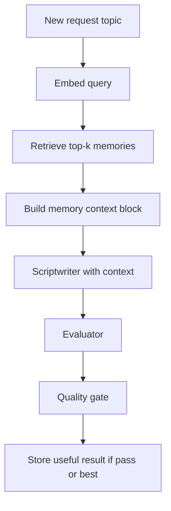

# Phase 11 — Long-Term AI Memory / RAG


## Master alignment
- Active stack: LangGraph only
- ADK: archive only (not a second runtime)
- If this plan still describes ADK APIs below, treat them as historical; redesign for LangGraph in Steps 2–3 of the phase loop

## Scope lock

- One concept: **long-term memory via RAG for generation context** (LangGraph nodes)
- Single service; reuse Phase 10 PostgreSQL where possible
- Do **not** introduce microservices or Kafka
- Do **not** store secrets, full system prompts, or raw API keys
- Measure lift with Phase 8 eval harness (with vs without retrieval)
- Depends on: persistent executions/script_versions/evaluations, structured scripts, eval runner

---

## Teaching (before coding)

### RAG (Retrieval-Augmented Generation)

Instead of relying only on the model’s parametric memory, **retrieve** relevant external snippets and **augment** the prompt/context before generation. Here: past Shorts artifacts, not the open web (Google Search remains separate for facts).

### Embeddings

Vectors (e.g. 768-d) representing semantic meaning of text (hook, topic, script summary). Produced by an embedding model (Gemini embedding API or equivalent). Similar meanings → nearby vectors.

### Vector search

Nearest-neighbor query: given embedding(query), find top-k stored embeddings by distance (cosine / IP).

### Semantic similarity

Match by **meaning**, not keywords. “Build ADK agents” can retrieve “multi-agent workflows with Gemini” even without shared tokens.

### Short-term vs long-term memory

| | Short-term | Long-term |
|--|------------|-----------|
| Scope | Current workflow / session state | Across workflows over days/weeks |
| Store | LG checkpointer + execution checkpoint | Vector index + metadata in DB |
| Example | `generated_script` this run | Past winning hooks for “pytest” topics |

### What should NOT be stored

- API keys, `.env`, credentials  
- Full system instruction files (prompt IP / attack surface)  
- Raw user PII beyond the topic text they submitted for Shorts  
- Failed malformed JSON blobs  
- Low-signal noise: every retry draft with score &lt; threshold (optional: store only best per execution)  
- Copyrighted third-party content pasted by users without need  

**Store:** topic, hook text, compact script summary, scores, tags (success/fail), style notes if explicitly curated.

---

## Why not Qdrant first? (justification)

| Option | Pros | Cons |
|--------|------|------|
| **pgvector on existing Postgres** | One DB, one backup, fits Phase 10 monolith, enough for thousands–millions of rows at this scale | Weaker at huge scale / specialized ANN ops |
| **Qdrant** | Excellent vector UX, filters, scale-out | New moving part to run/secure/backup |

**Decision:** Use **pgvector** in the same PostgreSQL. Introduce **Qdrant only if** measured latency/scale or filter needs exceed Postgres—document as a future swap behind a `MemoryStore` interface.

---

## Target flow



### Memory types (metadata)

| Type | Content | When to retrieve |
|------|---------|------------------|
| `successful_hook` | hook + topic + score | Similar topics |
| `unsuccessful_hook` | hook + issues (what to avoid) | Similar topics |
| `script_success` | summary + CTA pattern | Similar topics |
| `creator_style` | curated style bullets (seed + optional admin) | Always small k=1–2 |
| `topic_history` | prior topics covered | Diversity / avoid repeats |
| `audience_feedback` | later phase stub (schema ready, empty until HITL/feedback exists) | When present |

---

## Design (modular)

```text
memory/
  embeddings.py      # embed_texts()
  store.py           # MemoryStore protocol + PgVectorMemoryStore
  retriever.py       # retrieve(topic, k) -> MemoryHit[]
  context.py         # format hits into bounded context string
  writer.py          # persist after successful/best execution
```

### Schema addition (Alembic)

`memory_items`:

- `id`, `kind`, `topic`, `text`, `summary`, `embedding` (vector), `overall_score`, `execution_id`, `metadata` jsonb, `created_at`

Index: ivfflat/hnsw on embedding (cosine).

### LangGraph wiring

- Before Scriptwriter: retriever → write `state['memory_context']` (and optionally `state['retrieved_memory_ids']`)  
- Scriptwriter instruction: use `memory_context` as optional inspiration; do not copy verbatim; prefer facts from research tools when conflicting  
- After gate PASS (or EXHAUSTED best): `writer` upserts memory items for best script/hook with scores  

Bound context size (e.g. max 1500 chars / top-3) to control tokens.

### `MemoryStore` interface

Keeps Qdrant swappable later without rewriting agents.

---

## Measuring whether retrieval helps

Use Phase 8 dataset + runner:

1. Run A: `MEMORY_RETRIEVAL=false` → `results/runs/baseline_no_memory.json`  
2. Seed memory from prior successful fixtures or a warm-up pass  
3. Run B: `MEMORY_RETRIEVAL=true` → `results/runs/with_memory.json`  
4. `eval_compare` on `average_quality`, `pass_rate`, `average_iterations`

**Success criterion (initial):** no regression in `failure_rate`; target **+0.3** mean `overall_score` or **+5pp** pass_rate on the 20-case set (directional, not publication-grade significance). Document outcome honestly if flat/negative.

Do not optimize prompts aggressively in this phase—only add memory context channel.

---

## Tests (no live LLM for unit layer)

- Embedding client mocked → store/retrieve returns expected top-k order  
- Context builder respects max chars and excludes low-score items  
- Writer skips storage when score below threshold  
- Redaction: no API key fields in `memory_items`  
- Integration with SQLite/pgvector test skip if extension missing; mock store in CI default  

---

## What NOT to do

- Standalone “memory microservice”  
- Mandatory Qdrant in docker-compose for Phase 11  
- Store full conversation transcripts indefinitely without retention policy  
- Silent prompt rewriting beyond memory context injection  

**Retention (minimum):** document `MEMORY_RETENTION_DAYS` (e.g. 180) as config; optional cleanup job stub.

---

## Implementation order (after approval)

1. Teach RAG/embeddings/search/similarity/memory tiers + do-not-store  
2. Justify pgvector over Qdrant; define `MemoryStore`  
3. Migration + store/retriever/context/writer  
4. Wire into workflow state + scriptwriter  
5. Eval A/B measurement path  
6. Tests + docs of results protocol  

## Exit criteria

- Concepts explained  
- Retrieve → context → generate → evaluate → store path works  
- Vector search via pgvector (Qdrant not required)  
- Measurement protocol compares scores with/without retrieval  
- Unsafe/sensitive content policy documented and enforced in writer
