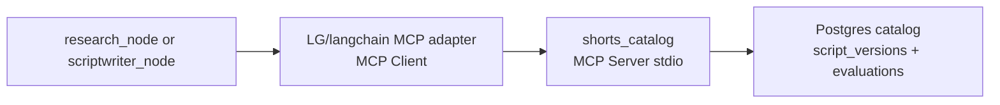

# Phase 12 — MCP Integration


## Master alignment
- Active stack: LangGraph only
- ADK: archive only (not a second runtime)
- If this plan still describes ADK APIs below, treat them as historical; redesign for LangGraph in Steps 2–3 of the phase loop

## Scope lock

- One concept: **MCP for agent↔tool/resource interoperability**
- Do **not** replace Scriptwriter / Evaluator / Gate / Visualizer / Formatter
- **One** MCP server only
- Use LangGraph/langchain MCP adapters + local stdio server
- Do **not** implement A2A in this phase
- Single service deploy: MCP server as a **subprocess** (stdio), not a microservice fleet

---

## Teaching

### MCP is not A2A

| | MCP | A2A |
|--|-----|-----|
| Primary link | **Agent ↔ tools/resources** | **Agent ↔ agent** |
| Exposes | tools, prompts, resources | agent capabilities / tasks |
| This phase | Yes | No (Phase 15) |

MCP standardizes how an agent discovers and calls external capabilities. A2A standardizes how agents delegate to other agents.

### Chain of responsibility

```text
Research / script LangGraph node
  → MCP Client (langchain-mcp / MultiServerMCPClient / thin adapter)
    → MCP Server (our shorts_catalog process)
      → Tool / Resource (list_shorts, get_short, etc.)
```

- **Agent:** decides *whether* to call a tool  
- **MCP Client:** protocol session, discovery, invocation  
- **MCP Server:** advertises tools; executes with local permissions  
- **Tool/Resource:** concrete operation (DB read, API call)

---

## Chosen integration (one server)

**Server:** `shorts_catalog` (in-repo Python MCP server)

**Why this (not YouTube/GitHub first):**

- Uses Phase 10 persistence you already own (no new SaaS keys)  
- Directly useful for developer Shorts (“what have we covered / winning hooks”)  
- Clear permission boundary: **read-only** catalog  
- Complements RAG (Phase 11): MCP is explicit tool use; RAG is automatic retrieval—both can coexist

**Deferred:** YouTube Data / GitHub MCP (extra credentials; add later behind same client patterns).

### Tools (read-only)

| Tool | Input | Output |
|------|-------|--------|
| `list_recent_shorts` | `limit: int` (1–20) | recent successful topics + scores |
| `search_shorts` | `query: str`, `limit: int` | keyword/topic match from catalog |
| `get_short` | `execution_id: uuid` | script summary + scores |

**Resources (optional, one):** `catalog://stats` — counts of stored shorts.

No write tools in Phase 12 (writes stay in app `memory.writer` / repository).

---

## Architecture



Attach MCP tools to the **Research** node (or Scriptwriter if Research not split yet)—**additive tools**, existing nodes remain.

Connection: stdio MCP client launching:

`python -m <langgraph_package>.mcp_servers.shorts_catalog`

---

## Implementation requirements

### Tool discovery

- Server registers tools via MCP SDK `list_tools`  
- Client: LangGraph/langchain MCP adapter discovers at session/graph start  
- Log discovered tool names under `workflow_id` (Phase 9)

### Tool invocation

- Node/model selects tool → client `call_tool` → server handler → JSON result  

### Input validation

- Pydantic models on server for each tool’s arguments  
- Reject out-of-range `limit`, invalid UUID, empty query  
- Return structured MCP error, not stack traces to the model

### Timeout

- Client-side timeout per call (e.g. 5s) via config `MCP_TOOL_TIMEOUT_SEC`  
- Server-side query timeout on DB  

### Error handling

| Failure | Behavior |
|---------|----------|
| Server crash / spawn fail | Log error; agent continues without catalog (degraded) |
| Validation error | Tool error payload; no retry storm |
| DB unavailable | Typed error; Research falls back to google_search only |
| Timeout | Cancel; count as tool failure in observability |

Do **not** generic-retry all MCP errors—only transient spawn/network if clearly transient (align Phase 6 classifier).

### Permission boundaries

- Read-only tools  
- Allowlist tool names in client config (`MCP_ALLOWED_TOOLS`)  
- No filesystem paths, no env dump tools  
- Server runs with DB read credentials only where possible  

### Observability

Log/trace fields: `workflow_id`, `mcp_server=shorts_catalog`, `tool`, `duration_ms`, `ok`, `error_type` — **not** full row payloads at INFO.

---

## Files

```text
mcp_servers/
  shorts_catalog/
    __main__.py
    server.py       # MCP server + tools
    schemas.py      # input validation
mcp_client.py       # helper to build MCP adapter/client from settings
```

Wire in graph/nodes module: add MCP tools to Research node only.

Config: `MCP_SHORTS_CATALOG_ENABLED=true`, timeout, allowed tools.

---

## Tests

**Integration** (`tests/integration/test_mcp_shorts_catalog.py`):

1. Server list_tools contains the three tools  
2. `list_recent_shorts` with seeded DB returns validated shape  
3. Invalid `limit=999` → validation error  
4. Timeout path (mock sleep / fake slow handler)  
5. Client allowlist blocks unknown tool name  
6. Node wiring: Research node includes MCP tools when enabled  

Use in-process or stdio subprocess with temp SQLite/Postgres test DB. Mark `@pytest.mark.integration`. No live Gemini required for server tests; agent wiring test can inspect toolset config without LLM.

---

## What NOT to do

- Replace google_search or evaluator with MCP  
- Add multiple MCP servers  
- Confuse catalog MCP with A2A agent delegation  
- Expose write/delete tools  
- Log secrets or full scripts at INFO  

---

## Implementation order (after approval)

1. Explain Agent→Client→Server→Tool and MCP vs A2A  
2. Implement `shorts_catalog` server + validation  
3. Wire LangGraph/langchain MCP adapters + permissions/timeout/obs  
4. Integration tests  
5. Document enablement and degraded behavior  

## Exit criteria

- Distinctions documented  
- One useful MCP server live  
- Discovery, invocation, validation, timeout, errors, permissions, observability implemented  
- Existing agents preserved  
- Integration tests green  
- MCP clearly not A2A
