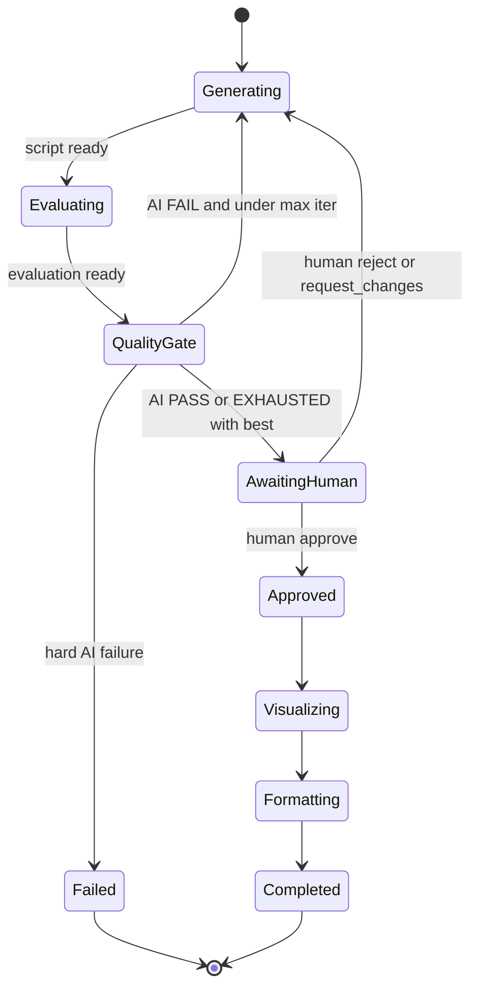
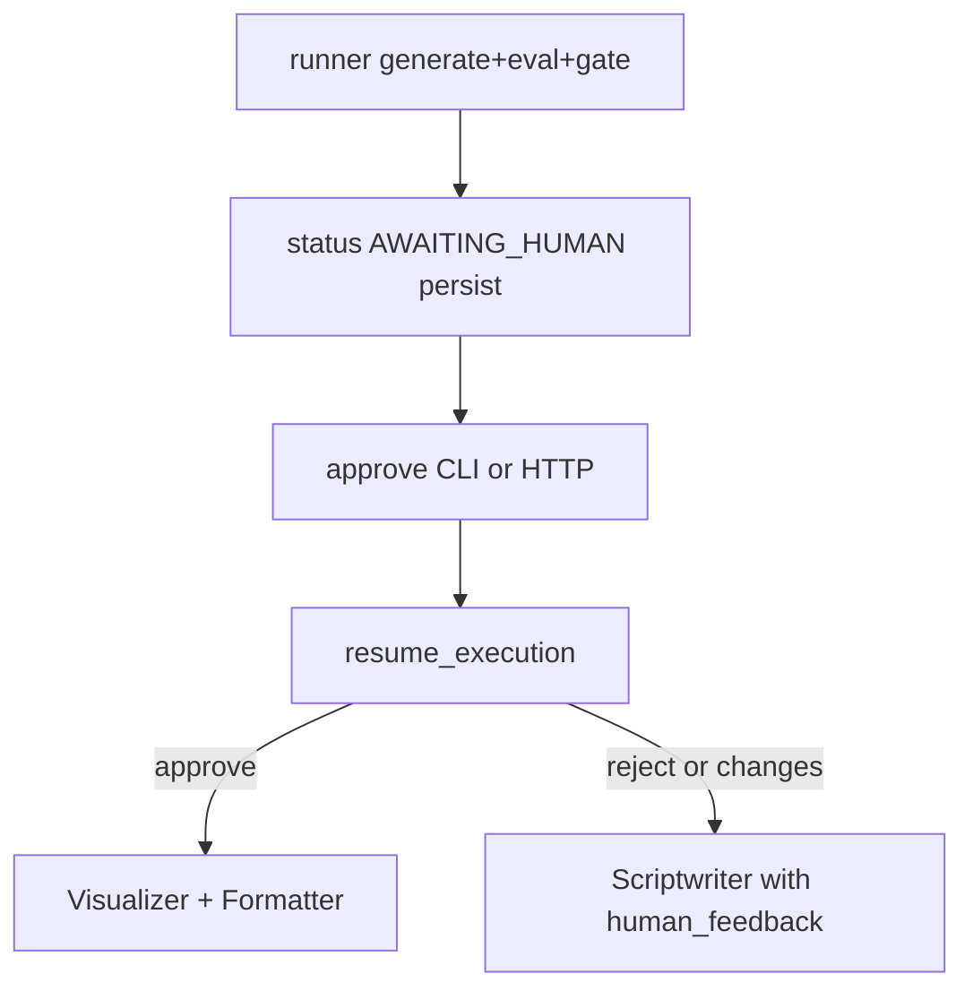

# Phase 13 — Human-in-the-Loop


## Master alignment
- Active stack: LangGraph only
- ADK: archive only (not a second runtime)
- If this plan still describes ADK APIs below, treat them as historical; redesign for LangGraph in Steps 2–3 of the phase loop

## Scope lock

- One concept: **human approval after AI quality gate**
- Stay on LangGraph (`interrupt` / resume); do not add a separate approval microservice
- Smallest useful version: pause execution → human decision + feedback in state → resume
- Do **not** build a full product UI/SSO; a CLI (and optional minimal HTTP endpoint in the same app) is enough
- Depends on: quality loop, `WorkflowState`, persistence/checkpointer (Phase 10) for durable pause/resume
- Prefer native LG `interrupt()` / `Command(resume=...)` over app-only pause when practical

---

## Why HITL matters in production AI

| Risk without humans | HITL control |
|---------------------|--------------|
| Confident wrong technical claims | Block publish until review |
| Brand/tone violations | Reject or request changes |
| Policy/legal sensitivity | Mandatory approve on tagged topics |
| Eval score ≠ business fit | Human overrides false PASS |
| Accountability | Audit who approved what |

AI gates optimize for **rubric scores**. Humans optimize for **accountability and residual risk**. Production systems use HITL at high-impact boundaries (here: before visuals/finalization/publish).

---

## State machine (design before coding)



### Transitions (normative)

| From | Event | To | State writes |
|------|-------|-----|----------------|
| QualityGate | `ai_pass` or `ai_exhausted` | `AWAITING_HUMAN` | `status`, checkpoint; **stop** before Visualizer |
| AWAITING_HUMAN | `approve` | `APPROVED` → Visualizer | `human_decision=approve`, `human_reviewed_at` |
| AWAITING_HUMAN | `reject` | Generating (new loop iter if allowed) | `human_decision=reject`, `human_feedback`, clear/keep issues |
| AWAITING_HUMAN | `request_changes` | Generating | `human_decision=request_changes`, `human_feedback` **required** |
| Generating | after human revise | Evaluating… | `human_feedback` visible to Scriptwriter |

**Policy default:** Human gate runs when AI gate would proceed to visuals (PASS or EXHAUSTED). Optional config `HITL_REQUIRED=true` (default true for learning/prod-like path); `false` skips for automated evals.

---

## Workflow state fields (human feedback is first-class)

Add to `WorkflowState`:

```text
human_decision: Optional[Literal["approve","reject","request_changes"]]
human_feedback: Optional[str]          # required if request_changes
human_reviewer: Optional[str]          # e.g. CLI user / "local"
human_reviewed_at: Optional[datetime]
status: includes AWAITING_HUMAN | APPROVED | ...
```

Persistence (Phase 10): checkpoint when entering `AWAITING_HUMAN`; append audit row optional `human_reviews(execution_id, decision, feedback, reviewer, created_at)`.

Scriptwriter instruction: if `human_feedback` present, treat as hard revision guidance (stronger than evaluator issues).

---

## Smallest useful implementation

**Not** a React console. **Yes:**

1. Pipeline stops after quality gate when HITL enabled → persist checkpoint → return `RunResult(status=AWAITING_HUMAN, execution_id=..., preview=script+scores)`  
2. CLI:

```bash
python -m youtube_shorts_assistant.approve \
  --execution-id <id> \
  --decision approve|reject|request_changes \
  --feedback "..." \
  --reviewer aman
```

3. Resume runner loads checkpoint, applies decision, either continues to Visualizer/Formatter or re-enters script loop with feedback  

**Optional same-process** FastAPI routes `POST /executions/{id}/approval` — only if CLI alone feels too thin; still one service.



---

## Interaction with AI quality loop

- AI loop (max 3) runs **before** human gate  
- Human reject/request_changes starts a **new** generation cycle; respect `max_iterations` **or** separate `human_revision_count` (default max 2 human revision rounds) to prevent infinite human ping-pong  
- **Chosen:** `max_human_rounds=2` in config; after exhaustion, status `FAILED` or `COMPLETED_WITH_BEST` requiring force-approve

---

## Observability / audit

Log: `workflow_id`, `execution_id`, `human_decision`, feedback length (not necessarily full text at INFO), reviewer, timestamps.  
Do not treat human feedback as secret by default (it is editorial); still avoid logging API keys.

---

## Tests

| Test | Expect |
|------|--------|
| AI pass → status `AWAITING_HUMAN`, visuals not run | |
| Approve → visualizer/formatter path invoked (mocked) | |
| Reject → scriptwriter receives prior eval; decision stored | |
| Request changes without feedback → validation error | |
| Request changes with feedback → `human_feedback` in state for next gen | |
| HITL disabled → skip to visuals (eval automation) | |

No live LLM required if gate/resume are unit-tested with fixtures.

---

## What NOT to do

- Slack/Jira enterprise approval products in this phase  
- Replacing AI evaluator with humans only  
- Microservices for “approval service”  
- Blocking Phase 8 bulk eval (use `HITL_REQUIRED=false` there)  

---

## Implementation order (after approval)

1. Explain HITL importance + present state machine  
2. Extend `WorkflowState` + persistence checkpoint/audit  
3. Split runner: `run_until_human` + `resume_with_decision`  
4. Add `approve` CLI  
5. Wire scriptwriter to `human_feedback`  
6. Tests for approve/reject/request_changes  
7. Document HITL flag for eval vs interactive runs  

## Exit criteria

- State machine implemented as designed  
- Human feedback in workflow state  
- Smallest useful approve/reject/request_changes path works  
- Continue vs revise behaviors correct  
- Importance of HITL explained in docs/wrap-up
