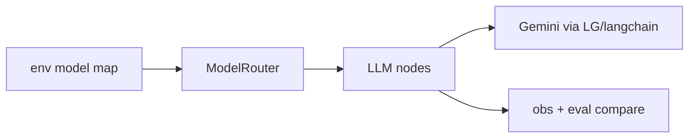

# Phase 14 — Model Routing


## Master alignment
- Active stack: LangGraph only
- ADK: archive only (not a second runtime)
- If this plan still describes ADK APIs below, treat them as historical; redesign for LangGraph in Steps 2–3 of the phase loop

## Scope lock

- One concept: **model abstraction + per-task routing**
- Do **not** change workflow business rules (gates, HITL, schemas)
- Do **not** hardcode a single model string on every LLM node
- Stay on LangGraph + Gemini (langchain-google-genai or google-genai); model IDs via ModelRouter
- Single service; no model-routing microservice

---

## Teaching: comparison (select one)

| Approach | How it works | Pros | Cons |
|----------|--------------|------|------|
| **Direct provider SDK** (`google-genai` only, no router) | Call Gemini yourself in each node | Full control over retries/params | Scattered model IDs; hard to A/B and fallback consistently |
| **LiteLLM** | Unified proxy/SDK for many providers; often `model="gemini/..."` | Multi-provider, budgets, fallovers | Extra dependency/ops; another failure domain; overkill if still Gemini-only |
| **Custom model abstraction** | `ModelRouter.for_task("research") -> model_id`; nodes read from router/config | Thin, testable, LG-friendly, explicit policy | You own fallback logic; not a full multi-cloud gateway |

### Selection

**Choose custom model abstraction + config-driven routing.**

**Why:** You are on LangGraph + Gemini for learning production *agent* engineering. Routing value here is **task-appropriate model tiers**, not multi-cloud. LiteLLM can wrap the same IDs later behind the same `ModelRouter` interface if you add OpenAI/Anthropic. Scattershot direct SDK calls without a router rejected.

---

## Routing dimensions

| Dimension | Use in policy |
|-----------|----------------|
| **task** | `research`, `write`, `evaluate`, `visualize`, `format` |
| **quality** | Prefer stronger model for write/evaluate |
| **latency** | Prefer flash for research/format |
| **cost** | Default map uses cheaper IDs for high-volume tools |
| **availability** | Ordered fallback list per task if primary fails (429/5xx) |

### Example policy (defaults)

| Task | Primary | Fallback | Rationale |
|------|---------|----------|-----------|
| research | `gemini-2.0-flash-001` | flash family | latency/cost; tool calls |
| write | `gemini-2.0-flash-001` or stronger if configured | flash | quality for scripts |
| evaluate | stronger or separate judge ID if available | flash | judge stability |
| visualize | flash | flash | structured, lower creativity need |
| format | flash | flash | schema fill |

Config via env/YAML — **no hardcoded single global model in graph/nodes**.

```text
MODEL_RESEARCH=gemini-2.0-flash-001
MODEL_WRITE=gemini-2.0-flash-001
MODEL_EVALUATE=gemini-2.0-flash-001
MODEL_VISUALIZE=gemini-2.0-flash-001
MODEL_FORMAT=gemini-2.0-flash-001
MODEL_FALLBACK=gemini-2.0-flash-001
```

Defaults can all equal today’s model → **business behavior unchanged** until you intentionally differentiate.

---

## Design

```text
models/
  types.py       # TaskType enum
  router.py      # ModelRouter.resolve(task) -> RouteDecision(model, reason)
  registry.py    # load from settings
```

```python
@dataclass
class RouteDecision:
    task: str
    model: str
    fallbacks: list[str]
    reason: str  # e.g. "write:quality"
```

Graph / nodes module:

```python
decision = model_router.resolve("write")
# scriptwriter_node uses decision.model (langchain-google-genai / google-genai)
# do not hardcode model IDs on each node
```

Optional: resilience layer (Phase 6) on permanent model failure tries `fallbacks[0]` **only for provider availability**, not for quality retries (quality loop stays separate).

### Metrics (comparison)

Emit observability fields (Phase 9):

- `model`, `task`, `route_reason`
- per-task latency, tokens, estimated cost
- eval scores **grouped by write/evaluate model** when A/B configs differ

Harness helper: run Phase 8 subset twice with different `MODEL_WRITE` and produce `model_compare.json` (avg quality, cost, latency). Do not auto-optimize—just measure.

---

## Architecture



---

## Tests

| Test | Assert |
|------|--------|
| Default settings | all tasks resolve to current production default (behavior parity) |
| Override `MODEL_WRITE` | only write-node model changes |
| Fallback list | resolve returns configured fallbacks |
| Availability path | mock primary fail → retry with fallback model id (unit on router/resilience hook) |
| Metrics stub | route decisions recorded with task+model |

No brittle LLM wording tests.

---

## What NOT to do

- Introduce LiteLLM “because everyone uses it” while still single-provider  
- Hardcode models in each node module again  
- Change prompts/gates while routing  
- Per-request dynamic “pick the best model with an LLM” (meta-routing) in this phase  

---

## Implementation order (after approval)

1. Compare three approaches; document custom router choice  
2. Add `ModelRouter` + settings  
3. Wire all LLM nodes’ model selection through router  
4. Confirm default config == previous single model (parity)  
5. Tests + optional model compare metrics path  
6. Wrap-up trade-offs  

## Exit criteria

- No single hardcoded model on every agent  
- Task-based routing with quality/latency/cost/availability knobs  
- Approach selected with trade-offs documented  
- Business behavior unchanged under default config  
- Tests + model comparison metrics path exist
