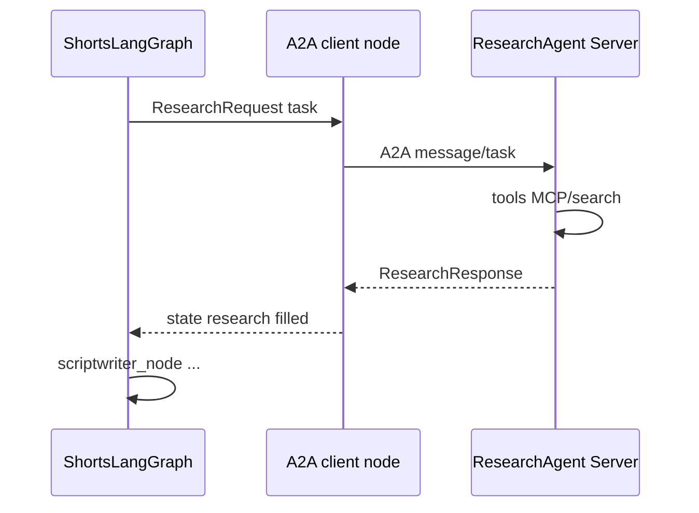
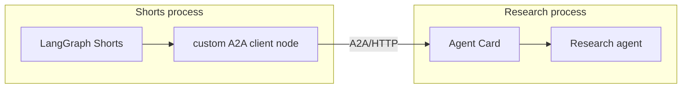

# Phase 15 — Agent-to-Agent Architecture


## Master alignment
- Active stack: LangGraph only
- ADK: archive only (not a second runtime)
- If this plan still describes ADK APIs below, treat them as historical; redesign for LangGraph in Steps 2–3 of the phase loop

## Prerequisite

Phase 12 MCP working (agent↔tool). This phase adds **agent↔agent** only after that distinction is clear in the project.

## Scope lock

- One concept: **A2A interoperability** (learning exercise)
- **One** second independently responsible agent: **Research Agent**
- Do **not** split Scriptwriter/Evaluator/Visualizer/Formatter into services
- Prefer a custom LangGraph research node (HTTP/A2A client) + local A2A server process experiment
- Feature flag: default path can remain in-process; A2A opt-in for the experiment
- Not microservices for their own sake

---

## Teaching

### MCP vs A2A

| | MCP | A2A |
|--|-----|-----|
| Relationship | **Agent ↔ Tool/Resource** | **Agent ↔ Agent** |
| Counterpart | catalog DB, APIs, files | another agent with goals/contracts |
| Example here | `shorts_catalog` tools | Research Agent produces research brief |

### Function call vs tool call vs MCP vs sub-agent vs A2A remote

| Mechanism | What it is | Boundary |
|-----------|------------|----------|
| **Function call** | Model emits a typed call; runtime executes a local Python function | In-process function |
| **Tool call** | Same idea in agent frameworks; tool may wrap APIs | Usually in-process or HTTP behind a tool |
| **MCP** | Standard protocol for discovering/calling **tools/resources** | Agent ↔ tool server |
| **Sub-agent / subgraph** | Another node or subgraph in the **same** LangGraph | Same process, shared state often |
| **A2A remote agent** | Protocol to message a **separate agent identity** (card, tasks, lifecycle) | Process/network boundary; own responsibility |

Sub-agent ≠ A2A: same graph composition vs **interop across agent boundaries**.

---

## Second agent: Research Agent (independent)

### Agent identity

- **Name:** `shorts_research_agent`  
- **URL (local):** `http://127.0.0.1:9101` (dev only)  
- **Agent card:** skills = technical research for developer Shorts  

### Capabilities

- Gather concise, sourced notes for a topic  
- Optionally use MCP `shorts_catalog` and/or google_search **inside the research agent**  
- Does **not** write final scripts or evaluate quality  

### Task contract

```text
ResearchRequest:
  topic: str
  audience: str = "developers"
  max_bullets: int = 8

ResearchResponse:
  topic: str
  bullets: list[str]          # facts / angles
  sources: list[str]          # urls or labels
  confidence: float           # 0-1
  errors: list[str] = []
```

Pydantic models in shared `contracts/research_a2a.py` (or under `a2a_research/`).

### Lifecycle



States: `submitted → working → completed | failed | timeout`.

### Failure handling

| Failure | Behavior |
|---------|----------|
| Research agent down | Timeout; Shorts continues with empty research + log (degraded) or fail if `A2A_RESEARCH_REQUIRED=true` |
| Malformed response | Validate; treat as failure; do not poison script state |
| Slow | `A2A_TIMEOUT_SEC` (e.g. 30s) |
| Partial | Return bullets with `errors[]` |

---

## Smallest A2A experiment (chosen technology)

**Stack:** LangGraph custom research client node + lightweight A2A/HTTP server process (official A2A Python pieces welcome). **Not** ADK `RemoteA2aAgent` as the primary design.

1. **`a2a_research/`** package: standalone research agent process + A2A/HTTP serve entry  
2. **Main Shorts LangGraph:** replace in-process research node with custom A2A client node when `A2A_RESEARCH_ENABLED=true`  
3. Map `ResearchResponse` → `WorkflowState.research` (string or structured dump)  
4. Local docker-compose **optional later**; Phase 15 docs: run two terminals (research server + shorts runner)

**Not in scope:** Kubernetes, service mesh, splitting the whole pipeline, reviving ADK as the A2A host.



---

## Definition of done for the learning exercise

- You can point to code and say: this boundary is **A2A**, that one is **MCP**, that one is **sub-agent**  
- Research has its own contract and can run as its own process  
- Shorts still owns script/eval/visual loop  
- Degraded path documented when research A2A is down  

---

## Tests

| Test | Type |
|------|------|
| `ResearchRequest`/`ResearchResponse` validation | unit |
| Mock A2A client returns brief → state.research set | unit/integration |
| Malformed A2A payload rejected | unit |
| `A2A_RESEARCH_ENABLED=false` uses in-process research (parity) | wiring |
| Optional: live local server smoke marked `@pytest.mark.a2a` | opt-in |

---

## What NOT to do

- Turn every existing agent into a remote service  
- Confuse MCP catalog tools with Research Agent  
- Require A2A for CI default  
- Design Netflix-scale agent mesh  

---

## Implementation order (after approval)

1. Teach MCP vs A2A and the five-way comparison table  
2. Freeze Research identity + request/response contracts  
3. Implement research agent app + local A2A serve  
4. Wire custom LG A2A client node behind feature flag  
5. Failure/timeout/degraded behavior + tests  
6. Wrap-up: when to use sub-agent vs A2A vs MCP  

## Exit criteria

- Clear conceptual distinctions documented  
- Independent Research Agent with contract  
- Smallest custom LangGraph A2A experiment runs locally  
- Pipeline not microservice-splattered  
- Learning goal (interop) met without unnecessary infra
