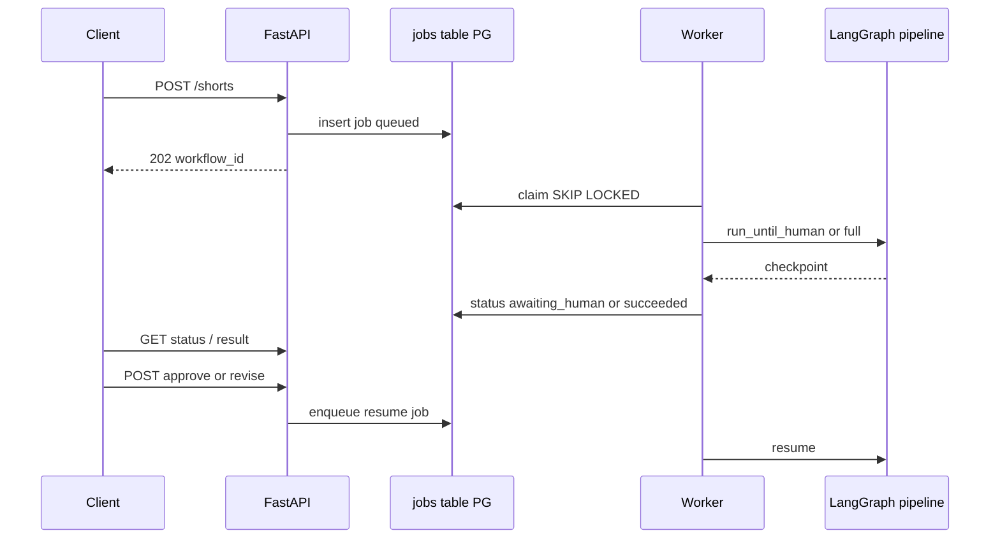

# Phase 16 — Production API and Asynchronous Execution


## Master alignment
- Active stack: LangGraph only
- ADK: archive only (not a second runtime)
- If this plan still describes ADK APIs below, treat them as historical; redesign for LangGraph in Steps 2–3 of the phase loop

## Scope lock

- One concept: **async job API + worker execution**
- API must **not** block on the full AI workflow
- Do **not** introduce Kubernetes
- Do **not** require a new microservice repo; modular monolith (API + worker share code)
- Queue: **PostgreSQL-backed jobs** (fits Phase 10; avoids Redis/K8s for this phase)
- Depends on: persistence, HITL approve/revise, workflow_id / execution ids, runner split

---

## Teaching (before coding)

### Synchronous vs asynchronous APIs

| Sync | Async (jobs) |
|------|----------------|
| Request held open until work finishes | Request accepted quickly; work continues elsewhere |
| Simple; timeouts on long LLM runs | Needs status/result endpoints |
| One connection per long job | Client polls or later webhooks |

LLM workflows (minutes, multi-agent) belong behind **async** APIs.

### Job

A durable unit of work: “run Shorts workflow for topic X” with id, payload, status, attempts.

### Worker

A process that **claims** jobs and runs the LangGraph pipeline (same codebase as API).

### Queue

Storage of pending jobs. Here: SQL table with `FOR UPDATE SKIP LOCKED` (no Redis/K8s).

### Idempotency

Same client key → same `workflow_id` / no duplicate side-by-side runs. Header `Idempotency-Key` on `POST /shorts`.

### Retries

Worker retries **transient** failures (Phase 6 classification) with backoff; permanent failures mark job `failed`.

### Status tracking

Authoritative status on `workflows` / `executions` / `jobs` rows: `queued | running | awaiting_human | succeeded | failed | cancelled`.

---

## API design

| Method | Path | Behavior |
|--------|------|----------|
| `POST` | `/shorts` | Validate body; enqueue job; **202** + `{ workflow_id, status: "queued" }` |
| `GET` | `/shorts/{workflow_id}` | Status + iteration/scores summary (no huge payloads) |
| `GET` | `/shorts/{workflow_id}/result` | Final concept when `succeeded` (or best on exhausted); **409/404** if not ready |
| `POST` | `/shorts/{workflow_id}/approve` | HITL approve (+ optional reviewer); resume job/continue |
| `POST` | `/shorts/{workflow_id}/revise` | HITL reject/request_changes + feedback; enqueue revise continuation |

### Request/response sketches

`POST /shorts`:

```json
{
  "topic": "How to use pydantic-settings",
  "audience": "developers",
  "hitl_required": true
}
```

Headers: `Idempotency-Key: <uuid>`

`202`:

```json
{ "workflow_id": "...", "status": "queued" }
```

`GET .../status` shape:

```json
{
  "workflow_id": "...",
  "status": "awaiting_human",
  "iteration": 2,
  "best_score": 8.2,
  "error": null
}
```

---

## Asynchronous execution design



### Components (one repo)

```text
api/
  app.py           # FastAPI routes
  schemas.py       # request/response models
worker/
  main.py          # poll loop
  runner_bridge.py # calls existing LangGraph runner/HITL resume
persistence/
  jobs.py          # enqueue/claim/complete
```

**Deploy locally:** `uvicorn` + `python -m youtube_shorts_assistant.worker` (two processes, not K8s).

### Job table (minimum)

`jobs(id, workflow_id, type, payload jsonb, status, idempotency_key unique, attempts, next_run_at, last_error, created_at, updated_at)`

Types: `run_pipeline`, `resume_approve`, `resume_revise`.

---

## Idempotency & retries

- Unique `(idempotency_key)` on create; replay returns original `workflow_id`  
- `attempts` + `max_attempts` (e.g. 3) for transient worker errors  
- Approve/revise: idempotent by `(workflow_id, decision, client_token)` optional  

---

## Auth (minimum)

Not full OAuth in this phase: `API_KEY` header check via settings for all mutating routes. Enough for “production-style” learning; document as temporary.

---

## Tests

| Test | Assert |
|------|--------|
| POST returns 202 + workflow_id quickly (mock enqueue) | |
| Idempotent POST same key → same workflow_id | |
| GET status queued/running/awaiting_human | |
| GET result before ready → 409 | |
| Approve/revise enqueue resume job | |
| Worker claim processes fake job to terminal status | |
| Transient failure increments attempts / retries | |

Use httpx `AsyncClient` + SQLite/PG test DB; no live LLM in CI.

---

## What NOT to do

- Kubernetes, Helm, service mesh  
- Celery+Redis **required** stack (PG queue is enough here)  
- Blocking `POST /shorts` until formatter finishes  
- Separate repos for API vs worker  

---

## Implementation order (after approval)

1. Teach sync/async, job, worker, queue, idempotency, retries, status  
2. Jobs schema + repository claim/enqueue  
3. FastAPI routes 202/status/result/approve/revise  
4. Worker loop calling existing LG graph runner/HITL  
5. API key + tests  
6. README: run API + worker locally  

## Exit criteria

- Concepts explained  
- Non-blocking `POST /shorts` → 202 + `workflow_id`  
- Status/result/approve/revise work  
- Async PG-backed worker; no K8s  
- Tests for idempotency, status, worker claim path
