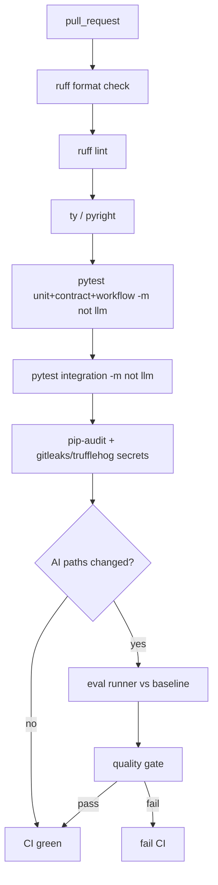

# Phase 18 — AI CI/CD


## Master alignment
- Active stack: LangGraph only
- ADK: archive only (not a second runtime)
- If this plan still describes ADK APIs below, treat them as historical; redesign for LangGraph in Steps 2–3 of the phase loop

## Scope lock

- One concept: **CI that covers software + AI quality gates**
- GitHub Actions on pull request (repo may need `git init` / remote if not yet a git repo)
- Do **not** require Kubernetes deploy in this phase
- Live LLM eval: **conditional** (label / path filter / nightly) with cached baseline compare—not unbounded Gemini spend on every typo PR
- Builds on Phase 7 test layout, Phase 8 dataset/baseline, Phase 17 security

**Status:** Implemented locally as **0.18.0** (2026-08-05). Uncommitted until batch check (Phases 11–21).  
**Commit policy:** batch code-check/commit for Phases 11–21 later (no commit until you ask).  
**Note:** Pushing `.github/workflows/*` may need GitHub token `workflow` scope (see `.github/README.md`).

## Inspect findings (2026-08-05)

| Area | Finding |
|------|---------|
| `.github/workflows/ci.yml` | **Thin**: ruff check + bare `pytest -q` (runs `@llm` if collected; no format/types/security) |
| Markers | Code uses `-m "not llm and not a2a"` locally; **CI does not** |
| pyright / ty | **Missing** from deps and CI |
| pip-audit / gitleaks | **Missing** |
| `eval_gate` module | **Missing** |
| `evals/quality_gate.yaml` | **Missing** |
| Smoke dataset | **Missing** (`shorts_v1_dataset.json` exists; no `shorts_v1_smoke.json`) |
| Committed baseline | **Missing** under `evals/results/baselines/` (only `.gitignore`) |
| `ai-eval.yml` / nightly | **Missing** |
| Phase 8 compare | `eval.compare` deltas exist — gate can wrap this |
| Package name | Use `python -m shorts_assistant.eval_gate` (not `youtube_shorts_assistant`) |

### What already exists (reuse)

- Test pyramid + markers (`llm`, `a2a`)  
- `python -m shorts_assistant.eval run|compare` (demo + live_judge)  
- `requirements-dev.txt` with pytest/ruff  
- Thin CI scaffold to expand  

### Gaps this phase must close

1. Expand `ci.yml`: format, lint, types (pyright basic), pytest with markers, pip-audit, secret scan  
2. `evals/quality_gate.yaml` + `shorts_assistant.eval_gate` (exit 1 on fail)  
3. Commit a **demo-mode** baseline (or generate in CI once) + smoke dataset (5 cases)  
4. `ai-eval.yml` path/label conditional; fork-safe skip without secrets  
5. `nightly-eval.yml` full dataset monitor  
6. Unit tests for gate logic; README: baseline update process + secrets  
7. Target **0.18.0**  

### Concrete design (for Approve)

**PR always (no Gemini):**
```text
ruff format --check → ruff check → pyright → pytest -m "not llm and not a2a"
→ pip-audit → gitleaks (or trufflehog)
```

**AI eval (conditional):**
- Paths: `prompts/`, `quality_gate.py`, `schemas.py`, `models/`, `judge.py`, `evals/*.json`, `demo_producers.py`, …
- Or label `run-ai-eval`
- Default mode for PR gate: **`demo`** (deterministic, free) vs committed `evals/results/baselines/baseline_demo_v1.json`
- Optional `live_judge` job only if `GOOGLE_API_KEY` secret present (skip forks)
- Smoke: `evals/shorts_v1_smoke.json` (5 cases); nightly: full 20

```text
src/shorts_assistant/eval_gate/
  __main__.py
  gate.py          # load yaml + compare_summaries → pass/fail
evals/
  quality_gate.yaml
  shorts_v1_smoke.json
  results/baselines/baseline_demo_v1.json
.github/workflows/
  ci.yml
  ai-eval.yml
  nightly-eval.yml
```

---

## Why traditional software CI is insufficient for AI

| Traditional CI catches | It misses |
|------------------------|-----------|
| Syntax, types, unit bugs | Prompt wording regressions |
| Broken APIs | Score drift (pass_rate ↓) |
| Dependency CVEs | Worse hooks / hallucinations |
| Deterministic test failures | “Still green tests, worse product” |

Agent behavior is **probabilistic** and **prompt-sensitive**. You need:

1. Deterministic control-plane tests (always)  
2. Eval dataset metrics vs **frozen baseline** (on AI-affecting changes)  
3. A **merge quality gate** on those metrics  

Without (2)(3), you can merge a prompt that tanks quality while pytest stays green.

---

## PR pipeline stages



### 1. Formatting

`ruff format --check .`

### 2. Lint

`ruff check .`

### 3. Type checking

`pyright` (or `ty`) on package; start with pragmatic `basic`/`standard` mode—fix gradually.

### 4. Unit tests

`pytest tests/unit tests/contract tests/workflow -q -m "not llm and not a2a"`

### 5. Integration tests

`pytest tests/integration -q -m "not llm"`  
(API/worker/MCP with fakes; no live Gemini)

### 6. Security scan

- `pip-audit` on requirements  
- Secret scan: `gitleaks` or `trufflehog` on checkout  
- Optional: `bandit` on `api/` `security/` only (keep signal high)

### 7. AI evaluation (conditional)

**Trigger when PR touches:**

- `*_instruction.txt`, `prompts/`, `agent.py`, `quality_gate.py`, `schemas.py`, `models/`, `evals/shorts_v1_dataset.json`, model env defaults  

**Or** label `run-ai-eval`.

**Job:**

1. Needs `GOOGLE_API_KEY` secret in GitHub  
2. Run eval runner on dataset (or smoke subset `n=5` on PR; full 20 on `main`/nightly)  
3. `eval_compare --baseline evals/results/baselines/baseline_v1.json --candidate <run>`  
4. Fail if gate thresholds breached  

---

## AI quality gate (merge blocker)

Config file [`evals/quality_gate.yaml`](evals/quality_gate.yaml):

```yaml
min_pass_rate_delta: -0.05      # allow at most -5pp vs baseline
min_average_quality_delta: -0.3
max_failure_rate: 0.15
max_failure_rate_delta: 0.05
```

**Rule:** candidate may not regress beyond deltas; absolute `failure_rate` cap always enforced.

Script: `python -m youtube_shorts_assistant.eval_gate --baseline ... --candidate ... --config evals/quality_gate.yaml` → exit 1 on fail.

Document: updating baseline is an **explicit** PR (human review), not silent overwrite in CI.

---

## Workflow files

```text
.github/workflows/ci.yml          # stages 1–6 always
.github/workflows/ai-eval.yml     # conditional/path/label; quality gate
.github/workflows/nightly-eval.yml  # full 20-case baseline monitor
```

Reuse/replace the thin CI from earlier scaffolding.

---

## Cost & flaky control

| Control | Choice |
|---------|--------|
| PR eval size | 5 stratified cases (`evals/shorts_v1_smoke.json`) |
| Full eval | nightly / main |
| Non-determinism | gate on **deltas + failure_rate**, not exact scores per case |
| No API key in fork PRs | skip eval with warning (do not fail OSS forks) |

---

## Tests for the gate itself

Deterministic unit tests on `eval_gate`:

- regression beyond delta → exit fail  
- improvement → pass  
- missing baseline → fail closed  

---

## What NOT to do

- Run full paid eval on every doc-only PR  
- Block merge on single-case score noise without deltas  
- Deploy to prod from this phase  
- Security theater scans that always warn and never fail on secrets  

---

## Implementation order (after approval)

1. Explain why software CI ≠ AI CI  
2. Expand `ci.yml`: format, lint, types, unit, integration, security  
3. Add `eval_gate` + `quality_gate.yaml`  
4. Add conditional `ai-eval.yml` + nightly  
5. Document secrets, labels, baseline update process  
6. Verify on a sample PR locally with `act` optional  

## Exit criteria

- PR CI runs format/lint/types/unit/integration/security  
- AI-affecting PRs run eval + quality gate  
- Gate config prevents unacceptable regression vs baseline  
- Rationale documented for AI-specific CI
