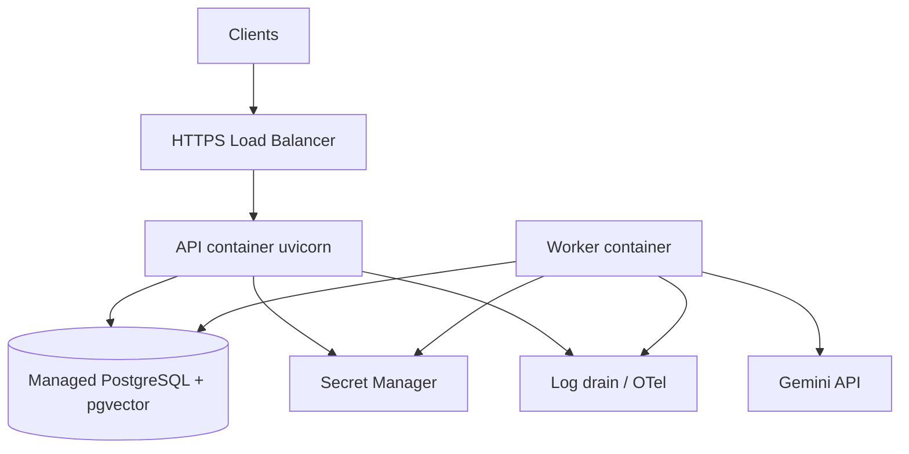
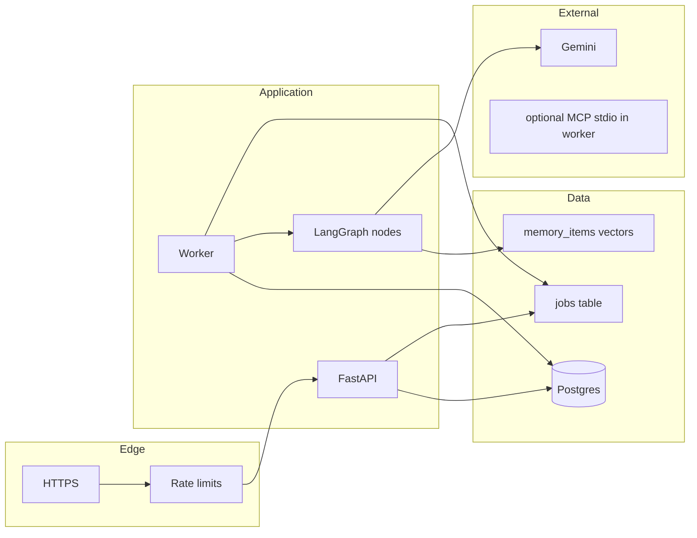
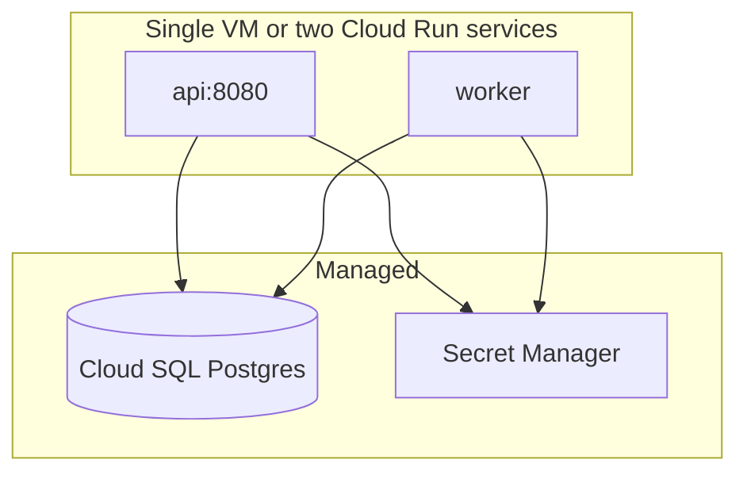

# Phase 19 — Production Deployment


## Master alignment
- Active stack: LangGraph only
- ADK: archive only (not a second runtime)
- If this plan still describes ADK APIs below, treat them as historical; redesign for LangGraph in Steps 2–3 of the phase loop

## Scope lock

- One concept: **simplest production deploy of the LangGraph modular monolith**
- **No Kubernetes** unless/until multi-tenant scale or multi-region orchestration demands it (not required now)
- Reuse: FastAPI API, PG job worker, Postgres+pgvector, OTel/logs, API rate limits
- Incremental implement: Docker images, Compose prod file, health endpoints, shutdown, runbooks—not a full multi-cloud mesh

**Status:** Implemented locally as **0.19.0** (2026-08-05). Uncommitted until batch check (Phases 11–21).  
**Commit policy:** batch code-check/commit for Phases 11–21 later (no commit until you ask).  
**Package name:** `shorts_assistant` (not ADK-era `youtube_shorts_assistant`).

## Inspect findings (2026-08-05)

| Area | Finding |
|------|---------|
| `Dockerfile` | **Stale ADK-era**: copies as `youtube_shorts_assistant/`, `CMD adk web`, Python 3.11 — **not** usable for current API/worker |
| `docker-compose.yml` | **Stale ADK-era**: single `app` service, `SESSION_DB_URL` sqlite, no api/worker split |
| `docker-compose.prod.yml` | **Missing** |
| Health probes | Only `GET /health` → `{"ok":"true"}` — **no** `/healthz`, `/readyz`, DB ping |
| API graceful shutdown | **Missing** lifespan / SIGTERM drain flag |
| Worker SIGTERM | **Present** — finishes current job then exits (`worker/main.py`) |
| Config | No `APP_ENV`; `validate_for_runtime()` only for Gemini key — **no** prod fail-fast (API_KEY, Postgres URL) |
| Migrations | Alembic exists; runtime still `ensure_schema()` / `create_all` — **no** migrate-on-release entrypoint |
| Memory / pgvector | Embeddings stored as **JSON** in SQL; store comments “pgvector later” — **do not** require vector column rewrite this phase |
| Job claim | PG `SKIP LOCKED` already implemented — good for multi-worker |
| Cost / rate limits | Phase 17 rate limit + `JOB_TIMEOUT_SEC` exist; no `MAX_CONCURRENT_JOBS` / daily budget alarm yet |
| Secrets runbook | **Missing** (Secret Manager → env mapping) |
| Tests | No `/readyz` / compose-config tests |

### What already exists (reuse)

- FastAPI `api/` + `worker/` + SQL jobs (`SKIP LOCKED`)  
- Alembic migrations (phases 10–17)  
- Phase 9 structured logs + optional OTel  
- Phase 17 API keys, rate limits, input/output guards  
- Worker SIGTERM stop-after-current-job  

### Gaps this phase must close

1. Replace Dockerfile with multi-stage, non-root LangGraph image (API + worker entrypoints)  
2. Add `docker-compose.prod.yml`: `migrate` → `api` + `worker` (+ optional Postgres/`pgvector` image for local staging)  
3. Add `/healthz` (liveness) + `/readyz` (DB ping + not shutting down); keep `/health` as alias  
4. API graceful shutdown via FastAPI lifespan + shared shutdown flag  
5. `APP_ENV` + `validate_for_production()` fail-fast; document Secret Manager mapping  
6. Migrate strategy: one-shot `alembic upgrade head` before api/worker (Compose `migrate` service / entrypoint)  
7. README runbook: staging → smoke `POST /shorts` → promote; justify no K8s  
8. Tests: healthz/readyz; shutdown flag; `docker compose -f docker-compose.prod.yml config`  
9. Target **0.19.0**  

### Concrete design (for Approve)

**Architecture (unchanged intent):** two app containers + managed Postgres; no K8s, no Kafka, no separate vector DB.

```text
Dockerfile                    # multi-stage, non-root, PYTHONPATH=/app/src
docker-compose.prod.yml       # migrate, api, worker [, postgres profile]
src/shorts_assistant/
  api/health.py               # /healthz /readyz (+ /health alias)
  runtime_lifecycle.py        # shutdown flag shared by API (+ worker reuse)
docs/runbooks/deploy.md       # staging/prod + Secret Manager env map
```

**Image / Compose**

| Service | Command | Notes |
|---------|---------|-------|
| `migrate` | `alembic upgrade head` | `restart: "no"`; api/worker `depends_on: service_completed_successfully` |
| `api` | `uvicorn shorts_assistant.api.app:app --host 0.0.0.0 --port 8080` | probes on `/healthz` / `/readyz` |
| `worker` | `python -m shorts_assistant.worker` | SIGTERM already drains current job |
| `postgres` | `pgvector/pgvector:pg16` | **optional** Compose profile `local-db` for staging-on-VM; prod uses managed SQL |

**Memory note:** keep JSON embeddings in Postgres for this phase (same DB). Document that pgvector extension can be enabled later without changing the deploy shape.

**Probes**

| Endpoint | Behavior |
|----------|----------|
| `GET /healthz` | 200 if process up (no DB) — liveness |
| `GET /readyz` | 200 if DB `SELECT 1` OK and not shutting down; else 503 |
| `GET /health` | Alias of `/healthz` (backward compatible) |

**Config (prod fail-fast when `APP_ENV=production`)**

- Require: `DATABASE_URL` (Postgres), `API_KEY` or `API_KEYS`, credentials (`GOOGLE_API_KEY` or Vertex)  
- Recommend: `CHECKPOINT_BACKEND=postgres`, `HITL_REQUIRED=true` (staging/prod), `LOG_PAYLOADS=false`  
- Optional cost knobs: document existing rate limit + `JOB_TIMEOUT_SEC`; add `MAX_CONCURRENT_JOBS` only if cheap (worker in-flight cap) — **nice-to-have**, not exit-blocking  

**Still out of scope:** Kubernetes manifests, Terraform, multi-region, forcing live Gemini in CI.

---

## Simplest production architecture (chosen)

**Pattern:** Two app containers + one managed database on a single cloud project.

| Component | Choice | Why |
|-----------|--------|-----|
| API | Container running uvicorn | `POST /shorts` 202 |
| Worker | Container running job poller | Async LangGraph graph execution |
| PostgreSQL + pgvector | Managed Postgres (Cloud SQL / RDS / Neon) | Sessions, jobs, memory vectors in **one** DB |
| Secrets | Cloud secret manager → env at runtime | No keys in images |
| Obs | Structured logs → Cloud Logging; optional OTLP | Phase 9 |
| Edge | Cloud Load Balancer / HTTPS + API key | Enough before service mesh |

**Rejected for v1:** K8s, separate Qdrant cluster, Kafka, multi-region active-active.



---

## 1. Architecture diagram (logical)



---

## 2. Deployment diagram (runtime)

**Dev/stage:** Docker Compose on one VM.

**Prod (simplest cloud):**

- Option A (recommended learning prod): **one VM** + Compose (`api`, `worker`, optionally local proxy) + **managed Postgres**  
- Option B: **Cloud Run** service for API + **Cloud Run job / always-on worker VM** for worker + Cloud SQL  



K8s **not** used: two processes do not justify control-plane cost.

---

## 3. Environment strategy

| Env | Purpose | Data | HITL | Eval |
|-----|---------|------|------|------|
| `local` | Dev | Compose Postgres | optional off | manual |
| `staging` | Pre-prod | isolated DB | on | smoke eval |
| `production` | Live | prod DB | on | nightly only |

Promote images by digest: `local → staging → production` (same artifact).

---

## 4. Configuration strategy

- **12-factor:** config via env; secrets via Secret Manager mounted as env  
- `APP_ENV=production`  
- Required: `DATABASE_URL`, `GOOGLE_API_KEY`, `API_KEYS`, `MODEL_*`, `QUALITY_THRESHOLD`, `HITL_REQUIRED`, `ENABLE_OTEL`, cost caps  
- Config validation at process start (fail fast) — extend [`config.py`](config.py)  
- No secrets in image layers; `.env` only for local  

---

## 5. Scaling strategy

| Layer | Scale how |
|-------|-----------|
| API | Horizontal: more API replicas behind LB (stateless) |
| Worker | Horizontal: more worker replicas claiming jobs (`SKIP LOCKED`) |
| DB | Vertical first; connection pooling (PgBouncer) if needed |
| LLM | Soft QPS via rate limits + `MAX_CONCURRENT_JOBS` per worker |

Scale workers when queue depth / `queued` age rises—not CPU alone.

---

## 6. Failure strategy

| Failure | Response |
|---------|----------|
| API crash | LB health fail → restart container; jobs unaffected |
| Worker crash | Job returns to `queued`/`retry` after lease timeout |
| DB down | Readiness fail; no claim; API 503 |
| Gemini 429/5xx | Phase 6 retries; then job failed / retryable |
| Deploy | Rolling: start new API → drain old (graceful timeout) |
| Poison message | `attempts >= max` → `failed`; alert on log metric |

**Graceful shutdown:** on SIGTERM, API stop accepting; worker finish current job or requeue; timeout e.g. 60–120s.

---

## 7. Cost considerations

| Cost driver | Control |
|-------------|---------|
| Gemini tokens | Model routing, max iterations, eval not on every request |
| Worker always-on | Size for queue; scale to zero only if job latency OK (Cloud Run jobs) |
| DB | Right-size; pgvector in same PG |
| Egress / logging | Sample debug payloads; `LOG_PAYLOADS=false` |
| Runaway jobs | Rate limits, `MAX_JOBS_PER_KEY_DAY`, wall-clock timeout |

Emit estimated cost metrics (Phase 9) and alert on daily budget threshold (log/metric alarm—simple).

---

## Health / readiness / liveness

| Probe | API | Worker |
|-------|-----|--------|
| **Liveness** | `GET /healthz` process up | process heartbeat file or `/healthz` sidecar loop |
| **Readiness** | `GET /readyz` DB ping OK | DB ping + not shutting down |
| **Startup** | migrations done (job or init container equivalent) | same |

Compose / VM supervisor use these probes; Cloud Run uses `/healthz` + `/readyz`.

---

## Incremental implementation (after approval)

1. Teach diagrams + env/config/scale/failure/cost  
2. Harden Dockerfile (multi-stage, non-root)  
3. `docker-compose.prod.yml`: api, worker, (optional local postgres for staging clone)  
4. Add `/healthz`, `/readyz`; SIGTERM graceful shutdown  
5. Alembic migrate on release job / API startup lock  
6. Secrets documented for GCP Secret Manager mapping  
7. Runbook in README: deploy staging → smoke `POST /shorts` → promote  
8. Optional: Terraform/script later—not required for phase exit  

**Still no K8s manifests.**

---

## Tests

- `/healthz` 200 without DB; `/readyz` 503 if DB down (mocked)  
- Compose config valid (`docker compose config`)  
- Shutdown handler unit test (flag set on SIGTERM)  

---

## Exit criteria

- Seven strategy sections documented and reflected in Compose/Docker  
- API + worker + Postgres(+vector) deployable without Kubernetes  
- Health/readiness/liveness + graceful shutdown  
- Secrets/obs/rate limits/cost controls accounted for  
- Incremental artifacts landed in repo
