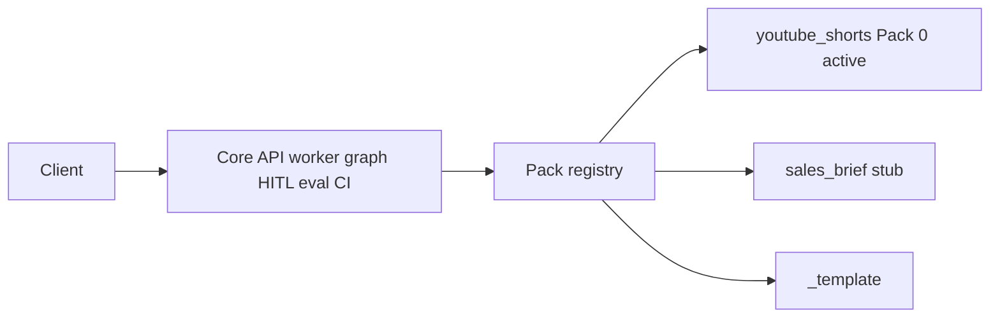

# Phase 22 — GTM accelerator / vertical packs


## Master alignment
- Active stack: LangGraph only (ADR 0001)
- ADK: archive only
- Do **not** adopt multi-orchestrator folder kits (CrewAI, etc.)
- Shorts remains the reference pack and demo

## Scope lock

- One concept: **shared core + vertical pack interface** for GTM prototypes  
- Soft extract — **no** rename of `shorts_assistant` → `accelerator` this phase  
- Second vertical = **stub pack** (schemas/prompts/eval smoke), not a second production graph  
- Default second pack id: **`sales_brief`** (account / opportunity brief → score → HITL). Swap on Approve if you prefer support/compliance.  
- Out of scope: multi-tenant SaaS, full API noun rename (`/cases`), Store API, Kubernetes  

**Status:** Implemented locally as **0.22.0** (2026-08-09). Second pack = `sales_brief` (stub). Uncommitted until you ask.

## Inspect findings (2026-08-07)

| Area | Finding |
|------|---------|
| Package | Single product package `shorts_assistant` — domain (ShortScript, Shorts prompts) **hard-wired** into nodes/judge/schemas |
| Graph topology | Reusable: research → memory → write ↔ eval ↔ gate → HITL → format-like deliverable |
| Control plane | API/worker/security/eval_gate/CI/Docker — **already accelerator-grade** |
| Packs | **Missing** — no `PACK_ID`, no pack registry, no template |
| Second vertical | **Missing** |
| GTM runbook | **Missing** (deploy runbook exists; prototype checklist does not) |
| Image-style tree | Intentionally different — keep modular monolith; packs are the extension point |

### What already exists (reuse as “core”)

- LangGraph loop + HITL + checkpointer  
- Memory/RAG, MCP, A2A patterns  
- Async jobs API + worker + security  
- Offline eval + quality gate + CI  
- Production Compose / health probes  

### Gaps this phase must close

1. `VerticalPack` contract + `get_pack(pack_id)` registry  
2. Register **`youtube_shorts`** as Pack 0 (metadata pointing at current paths)  
3. `packs/_template/` + `docs/runbooks/gtm_prototype.md`  
4. Stub **`sales_brief`** pack (schemas, prompts placeholders, 5-case smoke JSON)  
5. Config: `PACK_ID=youtube_shorts` (default); document how Pack 0 stays the live graph  
6. Tests for registry; README “accelerator” section; **0.22.0**  

### Concrete design (for Approve)

```text
src/shorts_assistant/
  packs/
    __init__.py              # get_pack / list_packs
    protocol.py              # VerticalPack Protocol / dataclass
    youtube_shorts/
      __init__.py            # Pack 0 metadata (points at existing schemas/prompts/evals)
      pack.toml or pack.py   # id, display_name, eval_dataset, smoke_dataset
    sales_brief/
      __init__.py
      schemas.py             # stub domain models (BriefDraft, BriefEvaluation, …)
      prompts/               # placeholder writer/evaluator.txt
      README.md              # how this pack will wire later
    _template/
      README.md
      schemas.py
      prompts/.gitkeep
evals/
  packs/
    sales_brief_v1_smoke.json   # 5 cases (structure only)
docs/runbooks/gtm_prototype.md
```

**`VerticalPack` fields (v1):**

| Field | Purpose |
|-------|---------|
| `pack_id` | e.g. `youtube_shorts`, `sales_brief` |
| `display_name` | Human label |
| `schemas_module` | Import path for domain models |
| `prompts_dir` | Path under pack or shared |
| `eval_dataset` / `smoke_dataset` | Paths for CI/GTM smoke |
| `mcp_tool_allowlist` | Optional tool names for this vertical |
| `active_graph` | bool — only Pack 0 (`youtube_shorts`) true until Phase 23 |

**Runtime rule this phase:**  
`PACK_ID` selects metadata for docs/eval/CLI listing. **Live invoke/API still runs the Shorts graph** until a later phase ports a second graph or pack-aware nodes. Stub pack proves the extension pattern without breaking Shorts.

**Later (not this phase):** pack-aware writer/evaluator nodes; generic `/cases` API; full `sales_brief` graph.



---

## Why this beats copying the agentic image tree

| Image kit | Our accelerator |
|-----------|-----------------|
| Many top-level domains + multi-orchestrator | One LangGraph core + packs |
| BaseAgent / BaseWorkflow hierarchies | Nodes + pack schemas/prompts |
| Framework-agnostic folder theater | Shipable GTM prototype in days |

---

## GTM prototype checklist (runbook content)

1. Copy `_template` → `packs/<vertical>/`  
2. Define 3–5 domain schemas + rubric fields  
3. Write writer/evaluator prompts  
4. Add 5-case smoke dataset + demo baseline later  
5. Stub MCP tools (read-only) if needed  
6. Demo with HITL on; CI with demo judge  
7. Only then wire into graph / API  

---

## Implementation order (after approval)

1. Teach: accelerator = core + packs (README)  
2. `packs/protocol.py` + registry + `PACK_ID`  
3. Pack 0 metadata for youtube_shorts  
4. `_template` + `gtm_prototype.md`  
5. `sales_brief` stub + smoke JSON  
6. Unit tests for registry; bump **0.22.0**  

## Exit criteria

- Pack registry loads Pack 0 + lists stub packs  
- Template + GTM runbook exist  
- Shorts still green (no behavior regression)  
- Clear path to Phase 23: activate second pack graph  

## What NOT to do

- Big-bang rename package or match the LinkedIn folder image  
- Port full sales graph in this phase  
- Multi-tenant billing / customer isolation  
- Revive ADK or add CrewAI  
