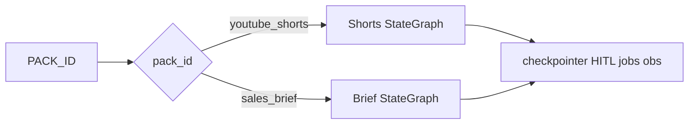

# Phase 23 — Live `sales_brief` pack


## Master alignment
- Active stack: LangGraph only (ADR 0001)
- ADK: archive only
- Phase 22 packs registry is the extension point — do **not** hard-wire a second product into Shorts schemas

## Scope lock

- One concept: **make `sales_brief` runnable** end-to-end (demo offline + HITL), selected by `PACK_ID`  
- Shorts Pack 0 remains default (`PACK_ID=youtube_shorts`); no behavior regression  
- **No** CrewAI / multi-orchestrator tree  
- **No** full CRM MCP (stub research notes only; MCP optional later)  
- **No** mandatory API rename to `/cases` this phase (CLI + `run_*` first; optional thin API alias if cheap)  
- Out of scope: multi-tenant SaaS, PostgresStore, Kubernetes  

**Status:** Implemented (2026-08-09) as **0.23.0** after Approve.

## Inspect findings (2026-08-09)

| Area | Finding |
|------|---------|
| Pack stub | `packs/sales_brief` has schemas/prompts/smoke; `active_graph=False` |
| Registry | `get_pack` / `PACK_ID` work; live invoke **ignores** pack |
| `WorkflowState` | Hard-typed to `ShortScript` / `ScriptEvaluation` / `VisualPlan` / `ShortConcept` |
| Nodes / judge / demo | Shorts-only (`demo_script`, `judge_script`, `guard_script`) |
| Graph topology | Includes visualizer — sales brief does **not** need shots |
| Quality gate | Needs `overall_score`, `approved`, best artifact — portable if brief eval mirrors that |
| Eval harness | Bound to Shorts dataset / invoke path |
| API | `/shorts` nouns — fine to leave Pack-0-only for this phase |

### What already exists (reuse)

- Pack registry + GTM runbook + smoke JSON  
- HITL interrupt/resume, quality gate pattern, memory retrieve, obs wrappers  
- CI markers, demo-mode offline pattern  

### Gaps this phase must close

1. Pack-local **state + graph** for sales brief (do not force BriefDraft into ShortScript fields)  
2. Demo writers/judge for `BriefDraft` / `BriefEvaluation`  
3. Topology without visualizer: … → HITL → formatter → END  
4. **Dispatch** in `run.py` / CLI: `PACK_ID=sales_brief` → sales graph  
5. Mark `sales_brief.active_graph=True` once wired  
6. Tests: offline complete path + HITL pause; Shorts still green  
7. Optional: run smoke dataset through pack invoke in demo mode  
8. Target **0.23.0**  

### Concrete design (for Approve)

**Choice: separate pack graph** (not schema adapter hacks on Shorts state).

```text
src/shorts_assistant/packs/sales_brief/
  state.py              # BriefWorkflowState (request, draft, evaluation, best_*, HITL, …)
  demo_producers.py     # demo_brief / demo_format_brief (+ reject/retry markers)
  judge.py              # synthetic BriefEvaluation (mirror Shorts demo judge)
  nodes.py              # research, memory, writer, evaluator, gate, hitl, formatter
  graph.py              # build_sales_brief_graph / get_compiled_sales_brief_graph
  quality_gate.py       # thin wrapper or shared apply_* if extracted
```

**Topology**

```text
research → memory_retrieve → writer ↔ evaluator ↔ quality_gate
                                    ↓ pass/exhausted
                               human_review → formatter → END
```

(No visualizer node.)

**Dispatch**

| `PACK_ID` | Entrypoint |
|-----------|------------|
| `youtube_shorts` (default) | existing `run_until_human` / Shorts graph |
| `sales_brief` | `packs.sales_brief` graph via same CLI/`run` facade |

```python
# run.py (sketch)
def run_until_human(...):
    pack = get_pack()
    if pack.pack_id == "sales_brief":
        return run_sales_brief_until_human(...)
    return run_shorts_until_human(...)  # today’s path
```

**Quality / HITL**

- Reuse HITL payload shape (`approve` / `reject` / `request_changes`)  
- Gate on `BriefEvaluation.overall_score` + `approved` + iteration budget  
- Memory retrieve can stay topic-based (same store); write path optional / Shorts-biased OK for v1  

**API**

- Keep `/shorts` for Pack 0  
- Optional: `POST /briefs` thin alias → same job table with `pack_id` in request payload — **nice-to-have**, not exit-blocking  

**Eval**

- Demo invoke over `evals/packs/sales_brief_v1_smoke.json` (5 cases)  
- Do not replace Shorts CI gate; add pack-specific test or optional script  



---

## Why not map BriefDraft → ShortScript

| Approach | Verdict |
|----------|---------|
| Stuff brief into hook/body/cta | Brittle; corrupts Shorts eval meanings |
| Generic `dict` artifact in shared state | Big bang; breaks typed contracts |
| **Pack-local state + graph** | Clean; Pack 0 untouched; matches accelerator story |

---

## Implementation order (after approval)

1. Teach: PACK_ID selects graph; Shorts default  
2. `BriefWorkflowState` + demo producers + judge  
3. Nodes + graph (no visualizer)  
4. Wire HITL + quality gate for brief  
5. Dispatch from `run` / `__main__`  
6. Tests + smoke; `active_graph=True` for sales_brief  
7. README + bump **0.23.0**  

## Exit criteria

- `PACK_ID=sales_brief` completes offline demo path to COMPLETED (HITL off)  
- HITL pause/resume works for brief pack  
- `PACK_ID=youtube_shorts` unchanged (existing tests green)  
- Registry shows both packs with `active_graph=True`  
- Smoke dataset runnable for brief (demo mode)  

## What NOT to do

- Rewrite Shorts schemas to be “generic”  
- Require live Gemini for brief pack  
- Full CRM/MCP integration  
- Multi-pack concurrent jobs in one thread without clear `pack_id`  
- Match the LinkedIn multi-orchestrator folder kit  
